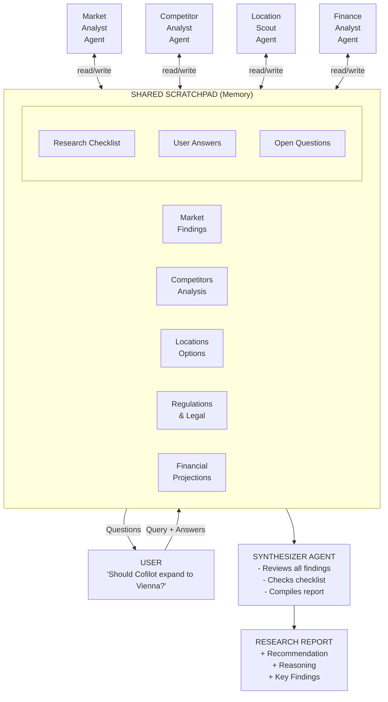
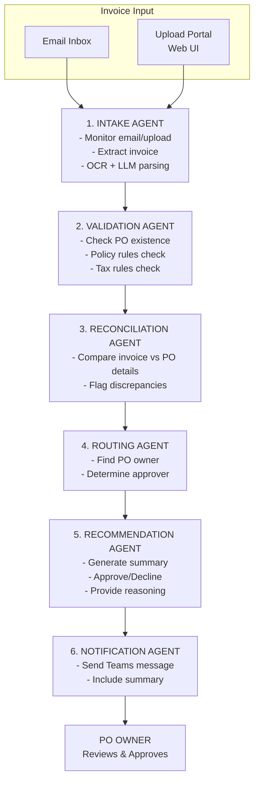

# Product Requirements Document (PRD)

> Cofilot - Coffee Company in Karlin, Prague

## 1. Metadata
- **Product / Feature Name**: Cofilot AI Platform
- **Author(s)**: Cofilot team
- **Date**: 2025-11-27
- **Revision**: 1.0
- **Status**: Draft
- **Related Docs**: N/A

---

# Part A: Multi-Agent AI Market Research (Agentic Demo)

## 2. Summary

This demo showcases how Azure AI Agents can perform **free-form, collaborative research** to answer complex business questions. Unlike the deterministic invoice workflow (Part B), this demo illustrates **agentic behavior**: multiple AI agents autonomously research, reason, and collaborate through a shared knowledge space to produce strategic recommendations. The primary demo scenario is market expansion research: *"Should Cofilot expand to Vienna?"*

This demo will be used in conferences, customer presentations, workshops, and POCs to illustrate how Azure AI Agent Service can tackle open-ended, strategic research tasks where the path to answers is not predetermined.

## 3. Goals & Non-Goals

| Goals | Non-Goals |
| --- | --- |
| Demonstrate true agentic behavior (reasoning + tool use + iteration) | Integration with real market research platforms |
| Show collaborative multi-agent research through shared memory | Production-grade data accuracy |
| Enable agents to autonomously explore and build on each other's findings | Real-time web scraping or live data feeds |
| Support human-in-the-loop interaction (agents can ask user questions) | Complex UI beyond demo requirements |
| Visualize agent collaboration, progress, and reasoning | Mobile app development |
| Produce synthesized research report with recommendation | Real customer data processing |
| Demonstrate contrast with deterministic workflows (Part B) | |

## 4. Success Metrics

| Metric | Target | Measurement Method |
| --- | --- | --- |
| Research completeness | All checklist items addressed | Automated checklist validation |
| Agent collaboration | Evidence of agents building on each other's findings | Review of shared scratchpad evolution |
| User interaction | At least 1 mid-research user prompt handled | Demo run validation |
| Demo engagement | Audience understands agentic vs. deterministic patterns | Post-demo survey |
| Report quality | Coherent, well-reasoned recommendation produced | Manual review |

## 5. Users & Personas

| Persona | Needs | Success Criteria |
| --- | --- | --- |
| Business Strategist | Get research-backed recommendations for expansion decisions | Comprehensive report with clear recommendation and reasoning |
| Demo Audience | Understand value of agentic AI for open-ended research | Clear visualization of agent reasoning, collaboration, and progress |
| Domain Expert | Provide input when agents need clarification | Agents ask relevant questions; user input influences research direction |

## 6. Assumptions & Constraints

### Assumptions
- Mock data will simulate market research sources (competitors, locations, regulations, etc.)
- Azure AI Agent Service and Microsoft Foundry are available and configured
- Users understand basic market research concepts
- Agents have access to shared memory/scratchpad for collaboration

### Constraints
- No real market data or proprietary research sources
- Demo environment only - not production-ready
- Limited to 1 primary research scenario with variations
- Target demo date: **December 8, 2025**
- Demo will include both pre-recorded (high reasoning effort) and live (lower reasoning effort) versions

## 7. Specification by Example

| Scenario | Given | When | Then | Automated Test? |
| --- | --- | --- | --- | --- |
| Complete research with recommendation | User asks "Should Cofilot expand to Vienna?" | Research completes | All checklist items addressed; synthesized report with clear recommendation | Yes |
| Agent collaboration | Market agent finds high coffee consumption | Competitor agent runs | Competitor agent references market findings in its analysis | Yes |
| User interaction mid-research | Agents identify need for budget clarification | Agents pause for input | User is prompted with specific questions; research resumes with user input | Yes |
| Research gap identified | Location agent finds missing neighborhood data | Agent reviews progress | Agent flags gap and attempts alternative research approach | Yes |
| Negative recommendation | Research reveals saturated market, high costs | Research completes | Report recommends against expansion with clear reasoning | Yes |

## 8. Requirements

### Functional

| ID | Requirement | Description |
| --- | --- | --- |
| FR1 | Research Query Intake | System accepts open-ended business research questions via web UI |
| FR2 | Market Analysis | Agent researches market size, trends, growth potential, and customer segments |
| FR3 | Competitor Analysis | Agent identifies and profiles key competitors (locations, pricing, positioning) |
| FR4 | Location Research | Agent evaluates potential locations (neighborhoods, rent, foot traffic, demographics) |
| FR5 | Regulatory Research | Agent investigates business requirements, permits, and compliance rules |
| FR6 | Financial Analysis | Agent builds projections based on gathered research data |
| FR7 | Shared Memory | All agents read from and write to a shared scratchpad/knowledge base |
| FR8 | Research Checklist | System tracks required deliverables; research continues until checklist complete |
| FR9 | User Interaction | Agents can pause to ask user clarifying questions; user responses influence research |
| FR10 | Report Synthesis | Synthesizer agent compiles findings into coherent recommendation report |
| FR11 | Process Visualization | Web UI displays real-time agent activity, scratchpad updates, and research progress |

### Non-Functional

- **Agentic Behavior**: Each agent must demonstrate reasoning loops (not single LLM calls)
- **Collaboration**: Agents must demonstrably build on each other's findings
- **Transparency**: Agent reasoning and tool usage must be visible in UI
- **Reliability**: Demo should complete successfully for primary scenario
- **Observability**: Real-time visualization of agent progress, scratchpad, and checklist status

## 9. UX & Flows

### Research Flow (Non-Deterministic)

### Research Checklist (Termination Criteria)

The following deliverables must be completed before research concludes:

| # | Checklist Item | Owner Agent |
|---|----------------|-------------|
| 1 | Market size and growth trends documented | Market Analyst |
| 2 | Customer segments and preferences identified | Market Analyst |
| 3 | Top 3-5 competitors profiled | Competitor Analyst |
| 4 | Competitive positioning gaps identified | Competitor Analyst |
| 5 | 2-3 potential locations evaluated | Location Scout |
| 6 | Key regulations and requirements listed | Location Scout |
| 7 | Financial projection created | Finance Analyst |
| 8 | Final recommendation with reasoning | Synthesizer |

### User Journeys

1. **Business Strategist Journey**:
   - Submits research question via web portal
   - Observes agents working collaboratively in real-time
   - Responds to clarifying questions when prompted
   - Receives comprehensive research report with recommendation

2. **Demo Audience Journey**:
   - Views research query submission
   - Observes agent reasoning, tool usage, and collaboration
   - Sees scratchpad evolving with findings
   - Watches checklist progress toward completion
   - Understands difference between agentic and deterministic AI patterns

### Web UI Components

- **Query Input**: Text input for research questions
- **Agent Activity Panel**: Real-time stream of agent actions and reasoning
- **Shared Scratchpad View**: Live visualization of accumulated knowledge
- **Research Checklist**: Progress tracker showing completed/pending items
- **User Prompt Modal**: Interface for answering agent questions
- **Final Report View**: Synthesized research output with recommendation

## 10. Dependencies

### Internal Services/APIs
- Azure AI Agent Service
- Microsoft Foundry (agent orchestration)
- Azure OpenAI Service (LLM for agent reasoning)
- Azure AI Search (semantic search for regulations, cultural data)
- Azure Cosmos DB (shared scratchpad persistence)

### Data Storage
- Static JSON files for mock data:
  - Market statistics and trends
  - Competitor profiles
  - Location/neighborhood data
  - Cofilot company profile
- Azure AI Search index for:
  - Regulatory and compliance rules (semantic search)
  - Coffee culture and preferences (semantic search)

### Launch Blockers
- Azure AI Agent Service availability
- Mock data preparation for Vienna expansion scenario
- Shared scratchpad implementation

## 11. Rollout Plan

| Milestone | Date | Description |
| --- | --- | --- |
| M1: Architecture Setup | 2025-12-01 | Azure services provisioned, scratchpad design |
| M2: Agent Development | 2025-12-04 | All 5 agents implemented with tool access |
| M3: Integration | 2025-12-06 | Agents collaborating via shared scratchpad |
| M4: UI Development | 2025-12-07 | Web portal with visualization components |
| M5: Demo Ready | 2025-12-08 | Full demo tested; pre-recorded and live versions ready |

### Training/Support Requirements
- Demo script preparation (including user interaction points)
- Pre-recorded demo with high reasoning effort model
- Live demo configuration with faster model for real-time execution
- Backup mock responses for fallback scenarios

## 12. Risks & Mitigations

| Risk | Impact | Likelihood | Mitigation |
| --- | --- | --- | --- |
| Agents produce inconsistent or low-quality research | High | Medium | Use structured prompts; validate against checklist |
| Agents fail to collaborate effectively | High | Medium | Test agent interactions; ensure scratchpad reads work |
| Demo takes too long (audience loses interest) | Medium | Medium | Pre-recorded version available; live version uses faster model |
| LLM hallucinations in research findings | Medium | Medium | Use mock data; validate outputs against known sources |
| User interaction disrupts flow | Low | Low | Design graceful handling; timeout with default values |
| Azure service unavailability | High | Low | Have recorded demo video as backup |

## 13. Open Questions

| ID | Question | Owner | Status |
| --- | --- | --- | --- |
| OQ1 | Specific Vienna market data to mock? | Engineering | Open |
| OQ2 | Austrian business regulations to include? | Domain SME | Open |
| OQ3 | What clarifying questions should agents ask users? | Product | Open |
| OQ4 | Should agents have access to "web search" (mocked)? | Engineering | Open |

## 14. Change Log

| Date | Author | Change |
| --- | --- | --- |
| 2025-11-27 | Cofilot team | Part A: Multi-Agent Market Research added |

---

# Part B: AI-Driven Invoice Approval Workflow (Deterministic Demo)

## 15. Summary

This demo showcases how Azure AI Agents can automate the end-to-end invoice processing workflow: from intake → validation → policy checks → routing → approval recommendations. The multi-agent AI system reduces manual workload in invoice processing by automating checks, validations, and approver notifications. This demo will be used in conferences, customer presentations, workshops, and POCs to illustrate how Azure AI Agent Service can orchestrate complex business processes.

## 16. Goals & Non-Goals

| Goals | Non-Goals |
| --- | --- |
| Automate invoice intake from email or upload portal | Integration with real ERP systems (SAP / Dynamics) |
| Extract invoice data using OCR + LLM | Production-grade security, monitoring, and logging |
| Validate PO number existence and match invoice to PO details | Actual payment execution |
| Perform policy compliance checks (internal + local tax rules) | Mobile app development |
| Identify PO owner and generate approval recommendations | Real customer data processing |
| Send notifications to approvers with summary | Complex UI beyond demo requirements |
| Demonstrate multi-agent orchestration with Microsoft Foundry | |
| Provide real-time visualization of processing events | |

## 17. Success Metrics

| Metric | Target | Measurement Method |
| --- | --- | --- |
| Invoice extraction accuracy | > 90% on structured invoices | Manual review of extracted fields vs. source |
| End-to-end workflow latency | < 10 seconds | Timestamp logging from intake to notification |
| Demo completion rate | 100% for 3-5 sample invoices | Demo run validation |
| Recommendation accuracy | 100% correct for test cases (match, mismatch, missing PO) | Test case validation |
| Stakeholder understanding | Positive feedback | Post-demo survey |

## 18. Users & Personas

| Persona | Needs | Success Criteria |
| --- | --- | --- |
| Supplier | Submit invoices easily via email or upload portal | Invoice submission triggers automatic processing |
| PO Owner | Receive summary and recommendation to approve invoices faster | Clear notification with AI recommendation and reasoning |
| Finance Team | Reduced manual workload, faster invoice processing | Automated validation and routing |
| Demo Audience | Understand value of multi-agent AI workflows | Clear visualization of agent interactions and decision flow |

## 19. Assumptions & Constraints

### Assumptions
- Demo invoices will be clean, structured documents (PDF format)
- Mock data will be used for PO database, vendor information, and policy rules
- Azure AI Agent Service and Microsoft Foundry are available and configured
- Users have basic understanding of invoice processing workflows

### Constraints
- No real customer PII or actual invoices will be used
- Demo environment only - not production-ready
- Limited to 3-5 invoice processing scenarios
- Target demo date: **December 8, 2025**

## 20. Specification by Example

| Scenario | Given | When | Then | Automated Test? |
| --- | --- | --- | --- | --- |
| Valid invoice with matching PO | Invoice with PO#12345, amount $1,000 | Invoice is submitted | System extracts data, validates PO, recommends approval | Yes |
| Invoice with amount mismatch | Invoice with PO#12345, amount $1,500 (PO shows $1,000) | Invoice is submitted | System flags discrepancy, recommends rejection with reason | Yes |
| Invoice with missing PO | Invoice without PO number | Invoice is submitted | System flags missing PO, recommends rejection | Yes |
| Invoice with policy violation | Invoice exceeds threshold without proper authorization | Invoice is submitted | System flags policy violation, recommends rejection | Yes |
| Invoice with tax compliance issue | Invoice missing required tax information | Invoice is submitted | System flags tax compliance issue, recommends rejection | Yes |

## 21. Requirements

### Functional

| ID | Requirement | Description |
| --- | --- | --- |
| FR1 | Invoice Intake | System must accept invoice via email or web upload portal |
| FR2 | Data Extraction | AI must extract key fields: Vendor, PO Number, Amount, Tax, Line items, Date |
| FR3 | PO Validation | System checks PO number existence in mock database |
| FR4 | Invoice-PO Matching | AI compares invoice data to PO details (amount, quantity, services) |
| FR5 | Internal Policy Check | AI checks internal policies (thresholds, vendor rules, approval limits) |
| FR6 | Tax Compliance Check | AI checks local tax compliance rules |
| FR7 | PO Owner Identification | System identifies PO owner from database |
| FR8 | Recommendation Generation | AI generates recommendation (Approve / Do not approve + detailed reason) |
| FR9 | Approver Notification | PO owner receives Teams notification with summary + recommendation |
| FR10 | Process Visualization | Web UI displays real-time stream of events showing processing status |

### Non-Functional

- **Performance**: End-to-end workflow < 10 seconds
- **Accuracy**: Invoice extraction > 90% on structured invoices
- **Reliability**: Demo should handle 3-5 invoices reliably
- **Security**: Mock data only; no customer PII or real invoices
- **Observability**: Real-time event streaming in UI for process visualization

## 22. UX & Flows

### Process Flow

### User Journeys

1. **Supplier Journey**: 
   - Supplier uploads invoice via web portal or sends via email
   - System acknowledges receipt
   - Processing begins automatically

2. **PO Owner Journey**:
   - Receives Teams notification with invoice summary
   - Reviews AI recommendation and reasoning
   - Makes approval decision faster with AI assistance

3. **Demo Audience Journey**:
   - Views real-time event stream in web UI
   - Observes each agent's actions and decisions
   - Understands multi-agent orchestration value

### Web UI Components

- **Upload Portal**: Drag-and-drop invoice upload interface
- **Event Stream Panel**: Real-time visualization of processing events
- **Invoice Details View**: Extracted data display
- **Recommendation Panel**: AI recommendation with reasoning

## 23. Dependencies

### Internal Services/APIs
- Azure AI Agent Service
- Microsoft Foundry (orchestration)
- Azure AI Document Intelligence (OCR)
- Azure OpenAI Service (LLM)
- Azure AI Search (semantic search for policy matching)

### Data Storage
- Static JSON files for:
  - PO database (mock)
  - Vendor information
  - PO owner mappings
- Azure AI Search for:
  - Policy rules (semantic search)
  - Tax compliance rules (semantic search)

### External Integrations
- Microsoft Teams (mock notification)

### Launch Blockers
- Azure AI Agent Service availability
- Sample invoice documents preparation
- Mock data setup

## 24. Rollout Plan

| Milestone | Date | Description |
| --- | --- | --- |
| M1: Architecture Setup | 2025-12-01 | Azure services provisioned, basic agent structure |
| M2: Agent Development | 2025-12-04 | All 6 agents implemented and tested individually |
| M3: Integration | 2025-12-06 | End-to-end workflow integration with Foundry |
| M4: UI Development | 2025-12-07 | Web portal with upload and event visualization |
| M5: Demo Ready | 2025-12-08 | Full demo tested with 3-5 sample invoices |

### Training/Support Requirements
- Demo script preparation
- Sample invoice preparation (valid, mismatch, missing PO scenarios)
- Backup mock responses for fallback scenarios

## 25. Risks & Mitigations

| Risk | Impact | Likelihood | Mitigation |
| --- | --- | --- |
| OCR errors on complicated invoices | High | Medium | Use clean, structured demo invoices |
| Slow response times | Medium | Low | Cache PO and policy data; optimize agent calls |
| Demo instability | High | Low | Pre-run warm-up; fallback to mock responses |
| Azure service unavailability | High | Low | Have recorded demo video as backup |
| LLM hallucinations | Medium | Medium | Use structured prompts; validate outputs |

## 26. Open Questions

| ID | Question | Owner | Status |
| --- | --- | --- | --- |
| OQ1 | Specific tax compliance rules to implement? | Finance SME | Open |
| OQ2 | Internal policy thresholds and rules details? | Finance SME | Open |
| OQ3 | Sample invoice templates and formats? | Engineering | Open |

## 27. Change Log

| Date | Author | Change |
| --- | --- | --- |
| 2025-11-27 | Cofilot team | Initial PRD creation |
| 2025-11-27 | Cofilot team | Part A: Multi-Agent Market Research added |
