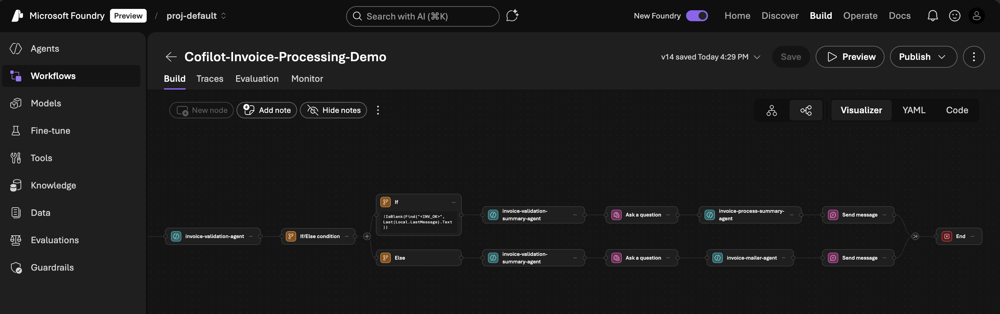
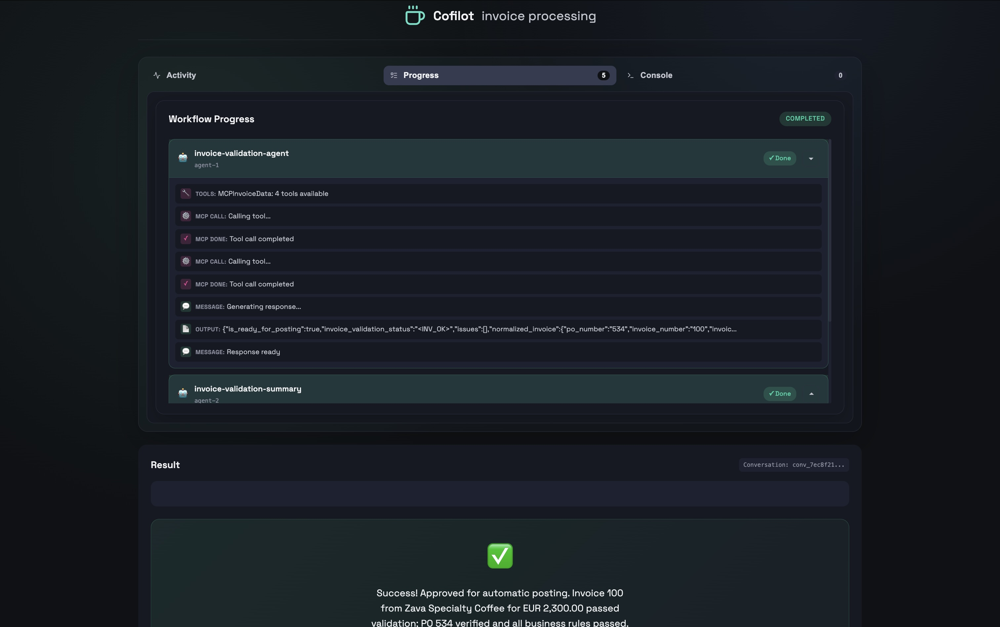

# Cloud and AI summit 2025 Czech - AI demo

## Cofilot AI Invoice processing workflow
> Multi-agent invoice extraction and validation workflow powered by Azure AI Foundry Workflows

- Agents are created and hosted in **Azure Foundry Workflows**
- MCP server runs **separatly as scalable microservice** in Azure Container Apps
- Demo application is a **Static Web App**, APIs hosted in Azure Container Apps and calls Foundry Workflow API
- Demo of automatic Invoice processing workflow with multiple agents collaborating to extract and validate invoice data implements **Human-in-the-loop** to approve important steps
- Agents use tools and Logic Apps connectors to access external systems (Office 365 Outlook)

> Known limitations:
> - Azure AI Foundry Workflows is in preview and some features are not yet available (sending user message with file/image - at this stage of demo it is mocked by sending direct JSON from invoice)

## Cofilot AI Research Platform

> Multi-agent research orchestration demo using Microsoft Agent Framework on Azure

See more details in [COFILOT_AI_RESEARCH.md](./COFILOT_AI_RESEARCH.md)

This project demonstrates a **collaborative AI research workflow** where multiple specialized agents work together to investigate business expansion opportunities for a specialty coffee company.

- Every agent and MCP server runs **separatly deployable and scalable microservices** in Azure Container Apps
- **A2A** is use between agents, **MCP** is used to access tools (mocked information for our demo - use questions around Brno or Vienna preferably)
- All A2A, MCP and API are **governed in Azure API Management** and visible in Foundry as registered assets
- **Agent as tool** pattern, **reasoning** model GPT 5
- Scratchpad strategy for **agentic shared memories** - plans, notes, draft, questions
- Implementation of **Human-in-the-loop** with clarifying questions of various priority

