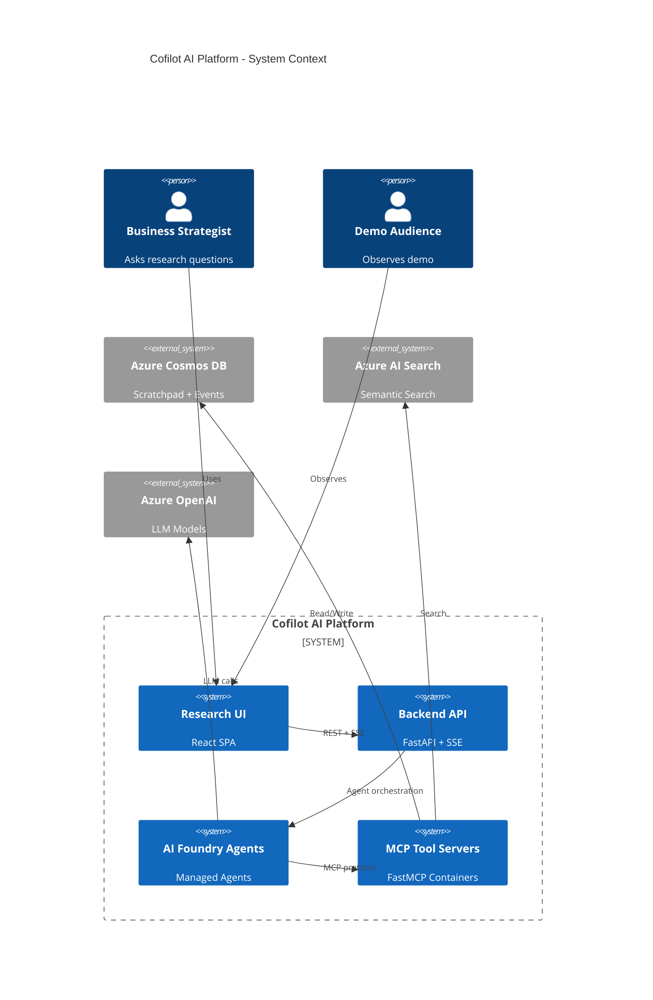
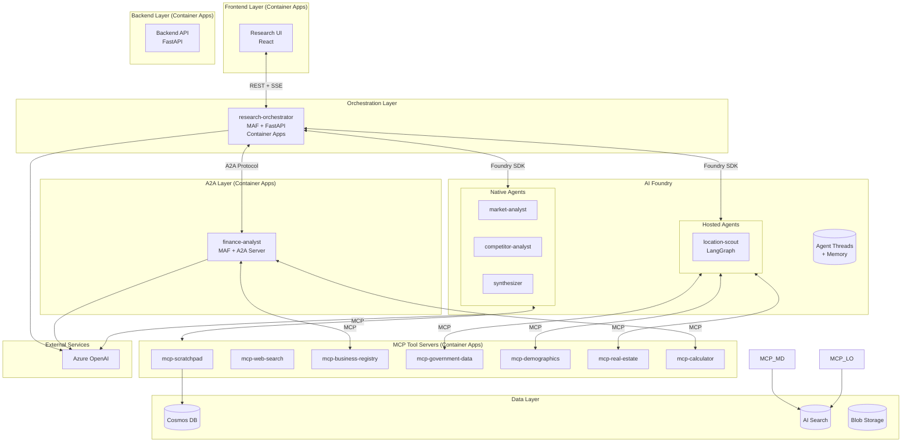
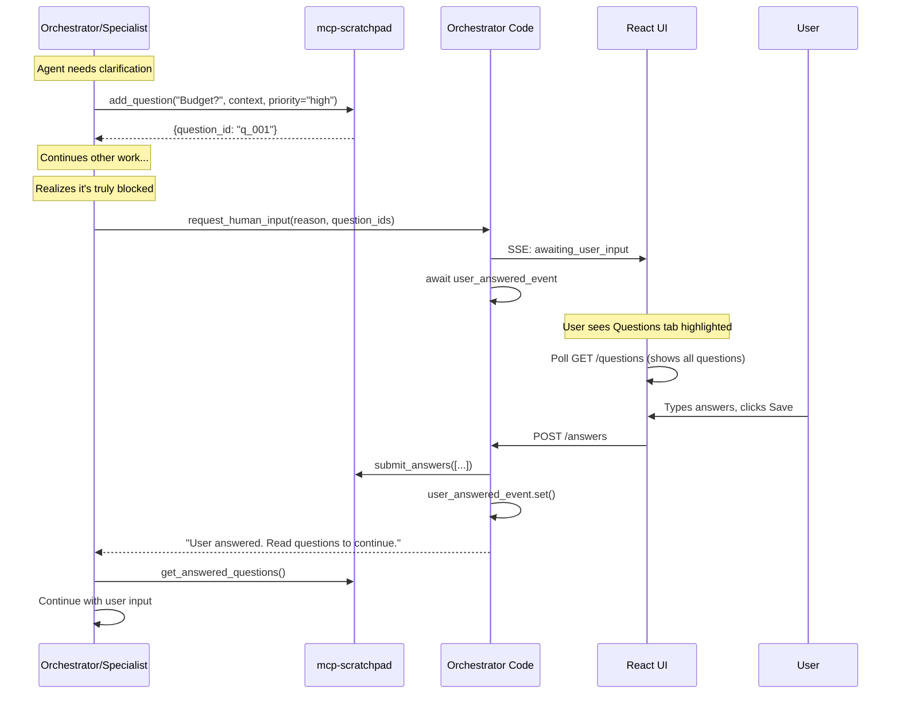

# Architecture Overview

Cofilot AI Platform - Multi-Agent Demo System for Azure AI Foundry

## Context

### Problem Statement
Demonstrate the capabilities of Azure AI Agent Service and AI Foundry for **agentic research**: free-form, collaborative multi-agent research with shared memory.

Additionally, demonstrate **heterogeneous agent deployment patterns**:
- **Microsoft Agent Framework (MAF)** orchestration in standalone containers
- **LangGraph** agents as Foundry Hosted Agents
- **A2A protocol** for cross-platform agent communication
- **Foundry Native** prompt-based agents with MCP tools

### Business Drivers
- Conference demos and customer presentations (target: December 8, 2025)
- POC/workshop enablement for Azure AI Agent Service adoption
- Demonstrate multi-framework agent interoperability

### User Personas
| Persona | System Interaction |
|---------|-------------------|
| Business Strategist | Submits research queries, answers clarifying questions, receives reports |
| Demo Audience | Observes real-time agent activity and decision visualization |

---

## Views

### System Context Diagram



### Container / Service View

| Component | Responsibility | Tech Stack | Deployment Target | Owners |
|-----------|---------------|------------|-------------------|--------|
| `frontend-research` | Research scenario UI with agent visualization | React, Vite, TailwindCSS | Azure Container Apps | Frontend |
| `backend-api` | REST API, SSE streaming, agent coordination | Python 3.11, FastAPI, Pydantic | Azure Container Apps | Backend |
| **Research Agents** | | | | |
| `agent-research-orchestrator` | MAF-based orchestrator with REST API for web UI | Python 3.11, MAF, FastAPI | Azure Container Apps | Platform |
| `agent-location-scout` | LangGraph agent for location/regulation analysis | Python 3.11, LangGraph, Hosted Agent Adapter | Foundry Hosted Agent | Platform |
| `agent-finance-analyst` | MAF agent exposed via A2A protocol | Python 3.11, MAF, A2A server | Azure Container Apps | Platform |
| `agent-market-analyst` | Foundry native agent for market research | Prompt-based, AI Foundry | AI Foundry Managed | Platform |
| `agent-competitor-analyst` | Foundry native agent for competitor analysis | Prompt-based, AI Foundry | AI Foundry Managed | Platform |
| `agent-synthesizer` | Foundry native agent for report synthesis | Prompt-based, AI Foundry | AI Foundry Managed | Platform |
| **MCP Tool Servers** | | | | |
| `mcp-scratchpad` | Shared memory tools for research agents | Python 3.11, FastMCP | Azure Container Apps | Backend |
| `mcp-business-registry` | Company data, financials, industry players | Python 3.11, FastMCP | Azure Container Apps | Backend |
| `mcp-government-data` | Permits, zoning, regulations, tax rates | Python 3.11, FastMCP | Azure Container Apps | Backend |
| `mcp-demographics` | Population, income, consumer behavior | Python 3.11, FastMCP | Azure Container Apps | Backend |
| `mcp-real-estate` | Properties, rental rates, foot traffic | Python 3.11, FastMCP | Azure Container Apps | Backend |
| `mcp-calculator` | Financial calculations and projections | Python 3.11, FastMCP | Azure Container Apps | Backend |

### Component Architecture



### Agent Deployment Patterns

| Pattern | Agent | Framework | Hosting | Communication |
|---------|-------|-----------|---------|---------------|
| **MAF Orchestrator** | research-orchestrator | Microsoft Agent Framework | Container Apps | REST API (web UI), SDK (Foundry agents), A2A (finance-analyst) |
| **Foundry Hosted Agent** | location-scout | LangGraph | Foundry Hosted Agent | Foundry Responses API, MCP |
| **A2A External Agent** | finance-analyst | Microsoft Agent Framework | Container Apps | A2A Protocol (managed identity auth) |
| **Foundry Native** | market-analyst, competitor-analyst, synthesizer | Prompt-based | AI Foundry Managed | Foundry Agent SDK, MCP |

---

## Research Agents Detail

### Agent Definitions

| Agent | Framework | Hosting | System Prompt Summary | MCP Servers |
|-------|-----------|---------|----------------------|-------------|
| **research-orchestrator** | MAF | Container Apps | Coordinates research workflow via REST API. Decides which agent to invoke, manages user questions. | `mcp-scratchpad` |
| **market-analyst** | MAF with A2A | Container Apps (A2A) | Researches market size, growth trends, customer segments. Writes findings to scratchpad. | `mcp-scratchpad`, `mcp-web-search`, `mcp-demographics` |
| **competitor-analyst** | MAF with A2A | Container Apps (A2A)| Identifies and profiles competitors. Reads market context from scratchpad first. | `mcp-scratchpad`, `mcp-web-search`, `mcp-business-registry` |
| **location-scout** | MAF with A2A | Container Apps (A2A) | Evaluates neighborhoods, regulations, rent. Can search regulatory database. | `mcp-scratchpad`, `mcp-government-data`, `mcp-demographics`, `mcp-real-estate` |
| **finance-analyst** | MAF with A2A | Container Apps (A2A) | Creates financial projections based on gathered data. Reads all sections from scratchpad. | `mcp-scratchpad`, `mcp-business-registry`, `mcp-government-data`, `mcp-real-estate`, `mcp-calculator` |
| **synthesizer** | MAF with A2A | Container Apps (A2A) | Compiles final report with recommendation. Reviews all scratchpad sections. | `mcp-scratchpad`, `mcp-calculator` |

### Research Flow


### MCP Server: mcp-scratchpad

```
Tools:
├── Notes (The Corkboard)
│   ├── add_note(content: str, tags: list[str]) -> str
│   └── read_notes(query: str, tag: str) -> list[Note]
├── Draft (The Manuscript)
│   ├── write_draft_section(section_id: str, title: str, content: str) -> bool
│   └── read_draft(section_id: str) -> dict
├── Plan (The Checklist)
│   ├── add_tasks(tasks: list[dict]) -> dict
│   ├── update_task(task_id: str, status: str, assigned_to: str) -> bool
│   └── read_plan() -> list[Task]
└── Questions (Human-in-the-Loop)
    ├── add_question(question: str, context: str, priority: str) -> dict
    ├── get_pending_questions() -> list[Question]
    ├── get_answered_questions() -> list[Question]
    └── get_all_questions() -> list[Question]
```

### MCP Server: mcp-business-registry

```
Tools:
├── search_companies(query: str, industry: str, location: str) -> list[CompanySummary]
├── get_company_profile(company_id: str) -> CompanyProfile
├── get_company_financials(company_id: str) -> CompanyFinancials
├── get_company_locations(company_id: str, city: str) -> list[CompanyLocation]
├── get_industry_players(industry: str, region: str, limit: int) -> list[IndustryPlayer]
└── get_company_news(company_id: str, days_back: int) -> list[NewsArticle]
```

### MCP Server: mcp-government-data

```
Tools:
├── get_business_permits(city: str, business_type: str) -> list[BusinessPermit]
├── get_zoning_info(city: str, district: str) -> ZoningInfo
├── get_regulations(country: str, industry: str, category: str) -> list[Regulation]
├── get_tax_rates(country: str, city: str) -> list[TaxInfo]
├── get_licensing_requirements(country: str, profession: str) -> list[LicenseRequirement]
├── get_health_safety_codes(country: str, establishment_type: str) -> list[HealthSafetyCode]
└── get_labor_laws(country: str, topics: list[str]) -> list[LaborLaw]
```

### MCP Server: mcp-demographics

```
Tools:
├── get_population_stats(city: str, district: str) -> PopulationStats
├── get_income_distribution(city: str, district: str) -> IncomeDistribution
├── get_age_distribution(city: str, district: str) -> AgeDistribution
├── get_consumer_spending(city: str, category: str) -> ConsumerSpending
├── get_lifestyle_segments(city: str, district: str) -> list[LifestyleSegment]
└── get_commuter_patterns(city: str, district: str, day_type: str) -> CommuterPattern
```

### MCP Server: mcp-real-estate

```
Tools:
├── search_commercial_properties(city: str, district: str, property_type: str) -> list[CommercialProperty]
├── get_rental_rates(city: str, district: str) -> RentalRates
├── get_foot_traffic(city: str, district: str) -> FootTraffic
├── get_nearby_amenities(city: str, address: str, radius_meters: int) -> list[NearbyAmenity]
├── get_location_score(city: str, district: str, business_type: str) -> LocationScore
├── get_vacancy_rates(city: str, district: str) -> VacancyRate
└── compare_locations(locations: list[Location], criteria: list[str]) -> LocationComparison
```

### MCP Server: mcp-calculator

```
Tools:
├── calculate_startup_costs(inputs: StartupCostInput) -> StartupCostResult
├── calculate_operating_costs(inputs: OperatingCostInput) -> OperatingCostResult
├── calculate_break_even(startup: float, monthly_fixed: float, avg_transaction: float) -> BreakEvenResult
├── calculate_roi(initial_investment: float, annual_profit: float, years: int) -> ROIResult
├── project_revenue(year1_monthly: float, growth_rate: float, years: int) -> list[RevenueProjection]
├── project_cash_flow(initial: float, monthly_revenue: float, monthly_costs: float, months: int) -> list[CashFlowProjection]
├── calculate_npv(initial: float, annual_cash_flows: list[float], discount_rate: float) -> NPVResult
└── sensitivity_analysis(base_profit: float, variable: str, base_value: float, impact_per_unit: float) -> SensitivityResult
```

---

## Cross-Cutting Concerns

### Session Isolation Architecture

All research sessions must be isolated from each other. The scratchpad must enforce that agents can only read/write data for their assigned session.

#### The Problem

Agents cannot be trusted to "remember" to pass session IDs - this must be enforced programmatically:


#### Solution: Session-Scoped MCP Tool Wrappers

The orchestrator creates **session-scoped MCP tool instances** that automatically inject the session ID into every request:


#### Implementation Pattern

```python
class ScopedMCPTool:
    """Wrapper that injects session_id into all MCP requests.
    
    This ensures session isolation is enforced programmatically,
    not by trusting AI agents to pass the correct session_id.
    """
    
    def __init__(self, base_mcp: MCPStreamableHTTPTool, session_id: str):
        self._base = base_mcp
        self._session_id = session_id
        
    @property
    def functions(self):
        # Wrap each function to inject session_id
        return [self._wrap_function(f) for f in self._base.functions]
    
    def _wrap_function(self, fn):
        """Wrap function to inject session_id as first argument."""
        async def wrapped(*args, **kwargs):
            # Session ID is injected by wrapper, not passed by AI
            return await fn(session_id=self._session_id, *args, **kwargs)
        return wrapped
```

#### Scratchpad Server Validation

The scratchpad MCP server validates session context on every request:

| Check | Failure Mode | Response |
|-------|--------------|----------|
| Session ID present in header | Missing | 400 Bad Request |
| Session exists | Unknown session | 404 Not Found |
| Session not expired | Expired | 410 Gone |
| Request matches session context | Mismatch | 403 Forbidden |

#### Headers for Session Context

```http
# Request to scratchpad MCP
POST /mcp HTTP/1.1
X-Session-ID: sess_abc123
X-Caller-Agent: market-analyst
Authorization: Bearer <api_key>
Content-Type: application/json

{"method": "add_note", "params": {"content": "Market is €500M", "tags": ["pricing"]}}
```

> **Note**: The `session_id` parameter is NOT passed in the MCP tool arguments. It's injected via HTTP headers by the session-scoped wrapper.

### Human-in-the-Loop (Questions)

The platform supports agents asking clarifying questions to users during research.

#### Design Principles

1. **Agents add questions anytime**: Both orchestrator and specialist agents can call `add_question()` when they need clarification
2. **UI polls for questions**: Frontend polls `/questions` endpoint (like Notes, Draft, Plan) - more reliable than SSE-only
3. **Agent decides when to read**: System prompt guides the orchestrator on when to check for answered questions
4. **Local blocking function**: Orchestrator has a local `request_human_input()` function (not MCP) to pause when truly blocked
5. **Save unblocks**: When user clicks Save on Questions tab, it submits answers AND unblocks if workflow is waiting

#### Question Flow



#### Question Priorities

| Priority | Meaning | Behavior |
|----------|---------|----------|
| `low` | Nice to have | Won't block research |
| `medium` | Improves quality | Agent may wait or proceed |
| `high` | Important | Should be answered before synthesis |
| `blocking` | Critical | Cannot proceed without answer |

See `specs/services/agent-research-orchestrator/ARCHITECTURE.md` for implementation details.

### Security Posture
- **Authentication**: None for demo (open access)
- **Data Classification**: All data is mock/synthetic - no PII
- **Network**: Container Apps with internal VNet for MCP servers
- **Session Isolation**: Enforced programmatically via scoped MCP wrappers
- See `SECURITY.md` for details

### Performance Characteristics
| Metric | Target | Strategy |
|--------|--------|----------|
| Research scenario E2E | < 3 minutes | Parallel agent calls where possible |
| UI update latency | < 500ms | SSE streaming |
| Agent response time | < 5 seconds per turn | Model selection (GPT-4o for speed) |

### Resilience
- **Retry Strategy**: Exponential backoff for AI Foundry API calls
- **Fallback**: Pre-recorded demo responses for critical failures
- **Circuit Breaker**: Not implemented (demo scope)

---

## Dependencies

### Azure Services
| Service | Purpose | SKU/Tier |
|---------|---------|----------|
| Azure AI Foundry | Managed agents, threads | Standard |
| Azure OpenAI | GPT-4o, GPT-4o-mini | Standard |
| Azure Cosmos DB | Scratchpad, events | Serverless |
| Azure AI Search | Semantic search | Basic |
| Azure Container Apps | All containers | Consumption |
| Azure Container Registry | Container images | Basic |

### Third-Party Libraries
| Library | Purpose | Version |
|---------|---------|---------|
| FastAPI | Backend API framework | ^0.109.0 |
| FastMCP | MCP server framework | ^0.1.0 |
| azure-ai-projects | AI Foundry SDK | ^1.0.0 |
| azure-cosmos | Cosmos DB client | ^4.7.0 |
| pydantic | Data validation | ^2.5.0 |
| React | Frontend framework | ^18.0.0 |

---

## Specification by Example

| Scenario | Given | When | Then |
|----------|-------|------|------|
| SSE event delivery | User starts research | Agent completes a step | UI receives SSE event within 500ms |
| Scratchpad persistence | Market analyst writes findings | Competitor analyst runs | Competitor agent can read market findings |
| Agent thread isolation | Two concurrent research sessions | Both complete | Each session has isolated thread/memory |
| MCP tool timeout | MCP server is slow (>30s) | Agent calls tool | Agent receives timeout error, can retry |

---

## Decision References

- ADR-001: Use AI Foundry Managed Agents (pending)
- ADR-002: MCP over direct function calling (pending)
- ADR-003: SSE over WebSocket for real-time updates (pending)
- **ADR-005: Real-time Agent Observability via OpenTelemetry and Application Insights** - See `specs/platform/decisions/ADR-005-realtime-agent-observability.md` *(Partially superseded by ADR-007 for UI events)*
- **ADR-007: Direct Orchestrator Events for UI** - See `specs/platform/decisions/ADR-007-direct-orchestrator-events-for-ui.md`
