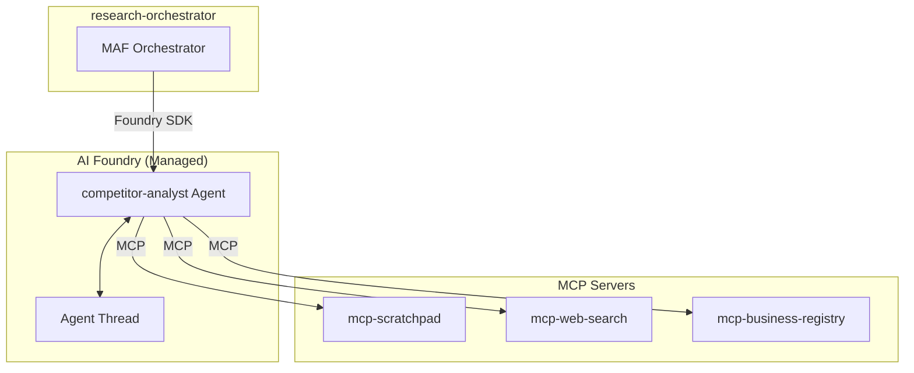

# Service Architecture: agent-competitor-analyst

Foundry Native prompt-based agent for competitor analysis.

## Context

- **Purpose**: Identify and profile competitors, analyze competitive landscape for expansion analysis
- **Upstream Dependencies**: research-orchestrator (via Foundry SDK)
- **Downstream Dependencies**: 
  - `mcp-scratchpad` (MCP Server) - shared workspace
  - `mcp-web-search` (MCP Server) - web search, news
  - `mcp-business-registry` (MCP Server) - company data, financials
  - Azure OpenAI (LLM - Foundry managed)

## Component Diagram



## Agent Definition

### System Prompt
```
You are a competitive intelligence analyst specializing in the coffee and café industry.
Your role is to identify and analyze competitors for potential expansion locations.

Tasks:
1. First, read the market findings from the scratchpad to understand the context
2. Identify key competitors in the target city
3. Profile each competitor (positioning, strengths, weaknesses)
4. Analyze the competitive landscape
5. Document findings in the scratchpad

Always:
- Read market context from scratchpad before starting
- Use competitor tools to gather data
- Provide actionable competitive insights
- Update the checklist when complete
```

### MCP Tools
| Tool | Server | Purpose |
|------|--------|--------|
| `read_section` | mcp-scratchpad | Read market context |
| `write_section` | mcp-scratchpad | Store findings |
| `update_checklist` | mcp-scratchpad | Update progress |
| `search_web` | mcp-web-search | Search web for competitor info |
| `search_news` | mcp-web-search | Search competitor news |
| `search_companies` | mcp-business-registry | Find competitor companies |
| `get_company_profile` | mcp-business-registry | Get detailed company info |
| `get_company_financials` | mcp-business-registry | Get financial data |
| `get_company_locations` | mcp-business-registry | Get store locations |
| `get_industry_players` | mcp-business-registry | Get top industry players |

## Performance Targets
| Metric | Target |
|--------|--------|
| Agent execution time | < 30s |
| MCP tool call latency | < 5s |
