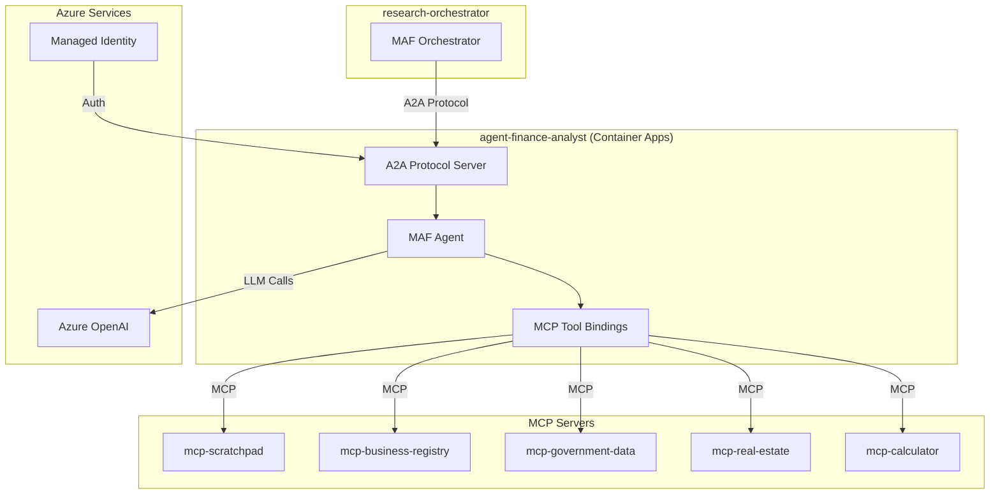
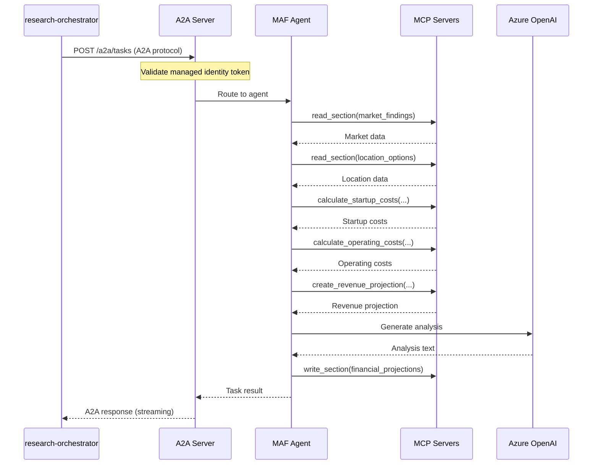

# Service Architecture: agent-finance-analyst

MAF-based agent for financial projections and analysis, deployed in Azure Container Apps and exposed via A2A protocol to demonstrate cross-platform agent communication.

## Context

- **Purpose**: Create financial projections, startup costs, operating costs, and break-even analysis. Demonstrates A2A protocol for external agent integration.
- **Upstream Dependencies**: research-orchestrator (via A2A Protocol)
- **Downstream Dependencies**: 
  - `mcp-scratchpad` (MCP Server) - shared workspace
  - `mcp-business-registry` (MCP Server) - company financials
  - `mcp-government-data` (MCP Server) - tax rates, regulations
  - `mcp-real-estate` (MCP Server) - rental rates
  - `mcp-calculator` (MCP Server) - financial calculations
  - Azure OpenAI (LLM)

## Component Diagram

## Data Flow

### A2A Invocation Flow

## Cross-Cutting Concerns

### Resilience Tactics
- **Retry**: MAF built-in retry on MCP failures
- **Timeout**: 60s per MCP call, 2min total execution
- **Circuit breaker**: On repeated MCP failures

### Performance Targets
| Metric | Target |
|--------|--------|
| A2A request latency | < 500ms (excluding agent execution) |
| Agent execution time | < 60s |
| MCP tool call latency | < 5s |

### A2A Protocol Compliance
- Implements [A2A Protocol](https://a2a-protocol.org/latest/)
- Supports task creation, status polling, and streaming responses
- Authentication via managed identity tokens

## Technology Stack

| Component | Technology | Version |
|-----------|------------|---------|
| Agent Framework | Microsoft Agent Framework | latest |
| A2A Server | Custom FastAPI implementation | 1.0 |
| HTTP Client | httpx | latest |
| Authentication | azure-identity | latest |
| Container | Python 3.11 slim | 3.11 |

## ADR References

- ADR-003: A2A for cross-platform agent communication (pending)
- ADR-006: Managed Identity for A2A authentication (pending)
