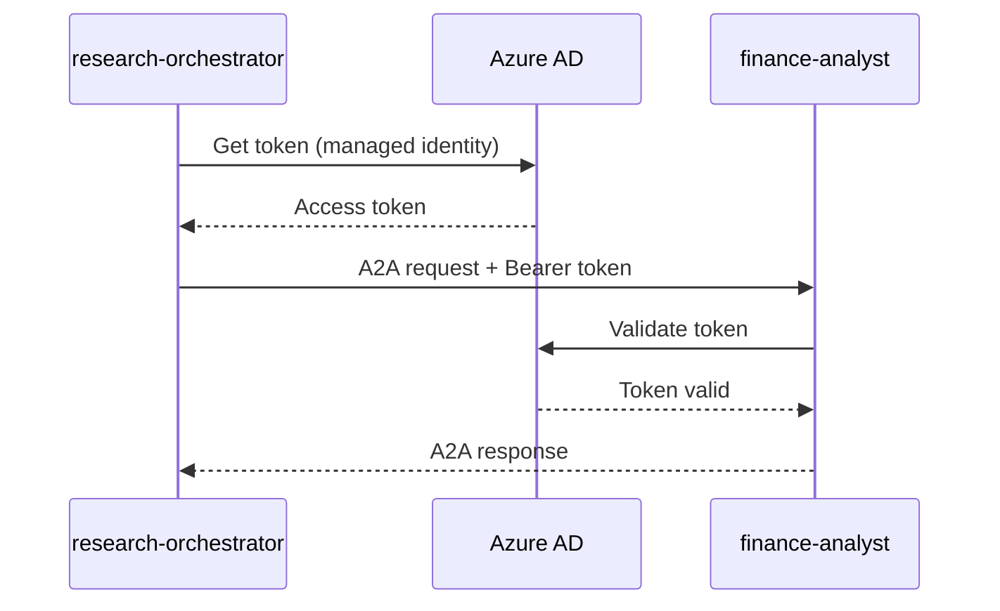

# Service Security: agent-finance-analyst

Security controls for the A2A agent.

## Threat Model Snapshot

| Asset | Threat | Mitigation |
|-------|--------|------------|
| A2A endpoint | Unauthorized access | Managed Identity auth, internal network |
| Agent credentials | Credential theft | Managed Identity, no secrets in code |
| Financial data | Data exposure | Internal network only, no persistence |
| LLM prompts | Prompt injection | Input validation, structured prompts |

## Controls Checklist

### Authentication/Authorization
- [ ] **A2A authentication**: Project Managed Identity
- [ ] **Network**: Internal Container Apps only (not exposed externally)
- [ ] **Token validation**: Validate Azure AD tokens on every request

### A2A Authentication Flow



### Secrets Handling
| Secret | Storage | Rotation |
|--------|---------|----------|
| Azure OpenAI credentials | Managed Identity | N/A |
| A2A audience | Environment variable | N/A |

### Data Classification
| Data Type | Classification | Handling |
|-----------|----------------|----------|
| Financial projections | Demo/Synthetic | No retention |
| Input data | Transient | In-memory only |

### Encryption
- **In transit**: TLS 1.2+ (Container Apps default)
- **At rest**: N/A (no persistent storage)

### Identity

```yaml
identity:
  type: SystemAssigned
  permissions:
    - Azure OpenAI: Cognitive Services OpenAI User
    - Key Vault: Key Vault Secrets User
```

## Testing & Monitoring

### Security Scans
| Scan | Tool | Frequency |
|------|------|-----------|
| Dependency vulnerabilities | pip-audit | Every build |
| Container vulnerabilities | Trivy | Every build |
| Token validation | Integration tests | Every build |

### Security Alerts
| Alert | Condition | Severity |
|-------|-----------|----------|
| Auth failures | >10 in 5min | High |
| Unknown caller | Token from unexpected source | High |

## Exceptions

| Exception | Owner | Expiration | Follow-up |
|-----------|-------|------------|-----------|
| Demo scope only | Platform Team | 2025-12-31 | Add RBAC for production |
