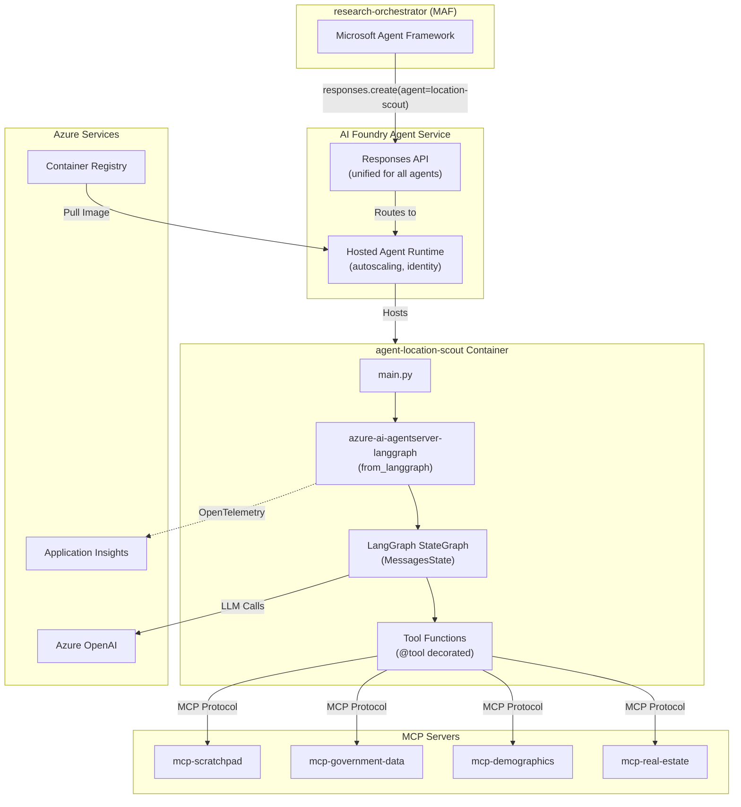
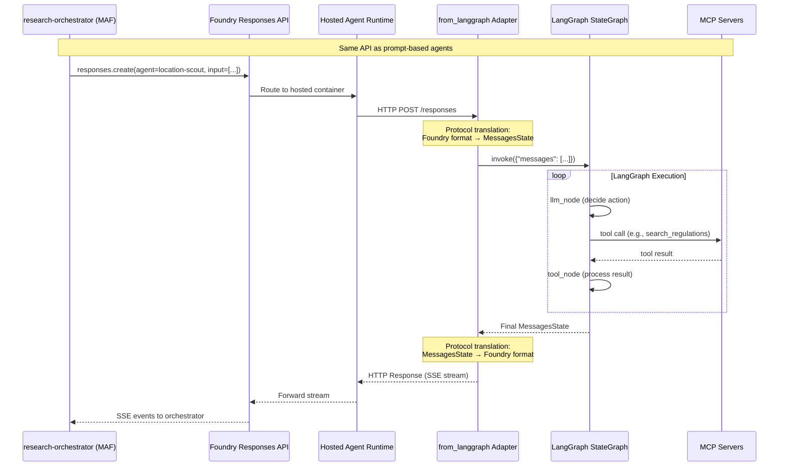

# Service Architecture: agent-location-scout

LangGraph-based agent for location and regulation analysis, deployed as a Foundry Hosted Agent.

## Context

- **Purpose**: Evaluate neighborhoods, regulations, rent prices, and local business requirements for expansion analysis
- **Upstream Dependencies**: research-orchestrator (via Foundry Responses API)
- **Downstream Dependencies**: 
  - `mcp-scratchpad` (MCP Server) - shared workspace
  - `mcp-government-data` (MCP Server) - permits, zoning, regulations
  - `mcp-demographics` (MCP Server) - population, foot traffic
  - `mcp-real-estate` (MCP Server) - properties, rental rates
  - Azure OpenAI (LLM)

## Foundry Hosted Agent Concept

### What is a Hosted Agent?

Hosted agents are **containerized agentic AI applications** running on Microsoft Foundry Agent Service. Unlike prompt-based agents (like market-analyst, competitor-analyst), hosted agents:
- Are built using code (LangGraph, MAF, or custom frameworks)
- Run as container images on Foundry-managed infrastructure
- Expose the **same Responses API** as prompt-based agents (unified invocation)

### What's Added on Top of Standard LangGraph

The Foundry hosting adapter requires **minimal additions** to standard LangGraph code:

| Addition | Purpose |
|----------|---------|
| `azure-ai-agentserver-langgraph` package | Hosting adapter that wraps LangGraph |
| `from_langgraph(agent).run()` | One-line to expose agent as HTTP service |
| `tool_client(context)` (optional) | Access Foundry-connected MCP servers |

#### Code Comparison

```python
# ═══════════════════════════════════════════════════════════════════
# STANDARD LANGGRAPH (runs locally, no hosting)
# ═══════════════════════════════════════════════════════════════════
from langgraph.graph import StateGraph, MessagesState, START, END
from langchain_openai import AzureChatOpenAI

model = AzureChatOpenAI(...)
tools = [my_tool_1, my_tool_2]

builder = StateGraph(MessagesState)
builder.add_node("llm", llm_node)
builder.add_node("tools", tool_node)
builder.add_edge(START, "llm")
builder.add_conditional_edges("llm", should_continue, {"tools": "tools", END: END})
builder.add_edge("tools", "llm")

agent = builder.compile()
# result = agent.invoke({"messages": [...]})  # Direct invocation

# ═══════════════════════════════════════════════════════════════════
# 🆕 FOUNDRY HOSTED AGENT (adds 2 lines)
# ═══════════════════════════════════════════════════════════════════
from azure.ai.agentserver.langgraph import from_langgraph  # 🆕 Line 1

# ... same LangGraph code as above ...

if __name__ == "__main__":
    from_langgraph(agent).run()  # 🆕 Line 2: Hosts on localhost:8088
```

### What the Hosting Adapter Provides Automatically

| Feature | Description |
|---------|-------------|
| **HTTP Server (port 8088)** | REST API compatible with Foundry Responses protocol |
| **Protocol Translation** | Converts Foundry request/response ↔ LangGraph MessagesState |
| **SSE Streaming** | Server-Sent Events for real-time response streaming |
| **OpenTelemetry Tracing** | Automatic spans for LLM calls, tool invocations, graph steps |
| **CORS Support** | Pre-configured for cross-origin requests |
| **Error Handling** | Proper HTTP error responses with diagnostics |
| **Conversation Management** | Foundry manages conversation state automatically |

### Invocation Parity with MAF Agents

**Critical**: Hosted agents are invoked **identically** to prompt-based agents:

```python
# research-orchestrator calling ANY agent (prompt or hosted)
from azure.ai.projects import AIProjectClient
from azure.ai.projects.models import AgentReference

client = AIProjectClient(endpoint=PROJECT_ENDPOINT, credential=DefaultAzureCredential())

# Works for market-analyst (prompt), competitor-analyst (prompt), 
# AND location-scout (hosted LangGraph) - same API!
agent = client.agents.retrieve(agent_name="location-scout")

openai_client = client.get_openai_client()
response = openai_client.responses.create(
    input=[{"role": "user", "content": "Analyze Prague locations for cafe expansion"}],
    extra_body={"agent": AgentReference(name=agent.name, version=agent.version).as_dict()}
)
```

## Component Diagram



## Data Flow

### Agent Invocation Flow



## Technology Stack

| Component | Technology | Version | Notes |
|-----------|------------|---------|-------|
| Agent Framework | LangGraph | latest | Standard LangGraph, no modifications |
| Hosting Adapter | azure-ai-agentserver-langgraph | latest | **Only Foundry-specific addition** |
| LLM Client | langchain-openai (AzureChatOpenAI) | latest | Standard LangChain |
| MCP Client | tool_client from azure.ai.agentshosting | latest | For Foundry-hosted MCP servers |
| Container Base | python:3.12-slim | 3.12 | Standard Python image |
| Observability | azure-monitor-opentelemetry | latest | Auto-configured by adapter |

## Project Structure

```
src/agent-location-scout/
├── __init__.py
├── main.py              # Entry point: from_langgraph(agent).run()
├── agent.py             # LangGraph StateGraph definition
├── tools.py             # @tool decorated functions for MCP calls
├── config.py            # Environment configuration
├── pyproject.toml       # Dependencies including azure-ai-agentserver-langgraph
├── Dockerfile           # Standard Python container
└── prompts/
    └── system.jinja2    # Agent system prompt
```

## Dependencies (pyproject.toml)

```toml
[project]
name = "agent-location-scout"
version = "0.1.0"
requires-python = ">=3.11"

dependencies = [
    # Standard LangGraph stack
    "langgraph>=0.2",
    "langchain>=0.3",
    "langchain-openai>=0.2",
    
    # 🆕 Foundry hosting adapter (THE key addition)
    "azure-ai-agentserver-langgraph>=1.0.0b5",
    
    # Azure authentication
    "azure-identity>=1.17",
    
    # Observability (auto-configured by adapter)
    "azure-monitor-opentelemetry>=1.6",
]
```

## Dockerfile

```dockerfile
FROM python:3.12-slim

WORKDIR /app

# Copy and install dependencies
COPY pyproject.toml .
RUN pip install .

# Copy application code
COPY . .

# Hosting adapter listens on 8088
EXPOSE 8088

# Entry point runs the hosted agent
CMD ["python", "main.py"]
```

## Local Development

```bash
# 1. Install dependencies
uv sync

# 2. Set environment variables
export AZURE_OPENAI_ENDPOINT="https://..."
export AZURE_AI_MODEL_DEPLOYMENT_NAME="gpt-4o"

# 3. Run locally (adapter hosts on localhost:8088)
uv run python main.py

# 4. Test with curl
curl -X POST http://localhost:8088/responses \
  -H "Content-Type: application/json" \
  -d '{"input": {"messages": [{"role": "user", "content": "Analyze Prague District 1 for cafe"}]}}'
```

## Deployment to Foundry

```python
from azure.ai.projects import AIProjectClient
from azure.ai.projects.models import ImageBasedHostedAgentDefinition, ProtocolVersionRecord, AgentProtocol

client = AIProjectClient(endpoint=PROJECT_ENDPOINT, credential=DefaultAzureCredential())

# Deploy container as hosted agent
agent = client.agents.create_version(
    agent_name="location-scout",
    definition=ImageBasedHostedAgentDefinition(
        image="<acr>.azurecr.io/location-scout:v1",
        cpu="1",
        memory="2Gi",
        container_protocol_versions=[
            ProtocolVersionRecord(protocol=AgentProtocol.RESPONSES, version="v1")
        ],
        environment_variables={
            "AZURE_AI_PROJECT_ENDPOINT": PROJECT_ENDPOINT,
            "AZURE_AI_MODEL_DEPLOYMENT_NAME": "gpt-4o",
        }
    )
)
```

## Cross-Cutting Concerns

### Resilience Tactics
- **Retry**: Built-in LangGraph retry on tool failures
- **Timeout**: 60s per MCP call, 5min total agent execution
- **Checkpointing**: LangGraph MemorySaver for state persistence (optional)

### Performance Targets
| Metric | Target |
|--------|--------|
| Agent invocation latency | < 30s |
| MCP tool call latency | < 5s |
| Total agent execution | < 2 min |

### Compliance/Residency
- Hosted in North Central US (Foundry limitation during preview)
- No PII stored in agent state
- Logs exported to connected Application Insights via OpenTelemetry

### Preview Limitations
| Limitation | Value | Impact |
|------------|-------|--------|
| Region | North Central US only | Latency if other services elsewhere |
| Max replicas | 5 | Scale ceiling during preview |
| LangGraph support | Python only | No C# (fine for this project) |

## Integration with research-orchestrator

The orchestrator treats location-scout identically to MAF prompt-based agents:

```python
# In orchestrator.py - add location-scout as another tool
LOCATION_SCOUT_AGENT_NAME = "location-scout"

location_scout_agent = self._create_foundry_agent(
    agent_name=LOCATION_SCOUT_AGENT_NAME,
    description="Analyzes location options, regulations, demographics, and real estate.",
)

location_scout_tool = location_scout_agent.as_tool(
    name="location_analysis",
    description="Analyze locations, local regulations, demographics, and real estate options.",
    arg_name="query",
    arg_description="The location analysis question to investigate",
)

# Add to orchestrator's available tools
orchestrator_agent = ChatAgent(
    tools=[market_tool, competitor_tool, location_scout_tool, synthesizer_tool],
    ...
)
```

## ADR References

- ADR-004: Use LangGraph for location-scout (pending)
- ADR-005: Foundry Hosted Agents for custom frameworks (pending)
