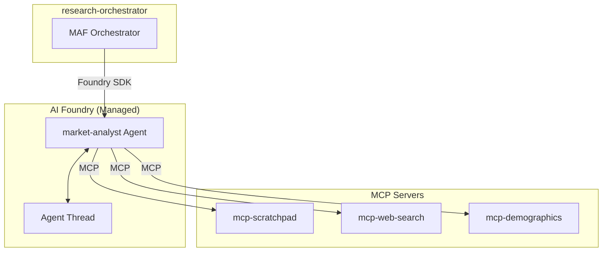

# Service Architecture: agent-market-analyst

Foundry Native prompt-based agent for market research and analysis.

## Context

- **Purpose**: Research market size, growth trends, customer segments, and coffee culture for expansion analysis
- **Upstream Dependencies**: research-orchestrator (via Foundry SDK)
- **Downstream Dependencies**: 
  - `mcp-scratchpad` (MCP Server) - shared workspace
  - `mcp-web-search` (MCP Server) - web search, news, social media
  - `mcp-demographics` (MCP Server) - population, income, consumer data
  - Azure OpenAI (LLM - Foundry managed)

## Component Diagram



## Agent Definition

### System Prompt
```
You are a market research analyst specializing in the coffee and café industry.
Your role is to research and analyze market data for potential expansion locations.

Tasks:
1. Research market size and growth trends for the target city
2. Identify customer segments and their preferences
3. Analyze local coffee culture and consumption patterns
4. Document findings in the scratchpad

Always:
- Start by checking if any previous research exists in the scratchpad
- Use the market data tools to gather quantitative data
- Write detailed findings to the scratchpad when complete
- Update the checklist to mark your task as complete
```

### MCP Tools
| Tool | Server | Purpose |
|------|--------|--------|
| `read_section` | mcp-scratchpad | Read existing research |
| `write_section` | mcp-scratchpad | Store findings |
| `update_checklist` | mcp-scratchpad | Update progress |
| `search_web` | mcp-web-search | Search web for market info |
| `search_news` | mcp-web-search | Search recent news articles |
| `search_social_media` | mcp-web-search | Search social media trends |
| `get_population_stats` | mcp-demographics | Get population data |
| `get_income_distribution` | mcp-demographics | Get income/purchasing power |
| `get_consumer_spending` | mcp-demographics | Get spending patterns |
| `get_lifestyle_segments` | mcp-demographics | Get consumer segments |

## Cross-Cutting Concerns

### Performance Targets
| Metric | Target |
|--------|--------|
| Agent execution time | < 30s |
| MCP tool call latency | < 5s |

### Resilience
- Foundry-managed retry and error handling
- MCP tool timeout: 30s

## Provisioning

Agent is provisioned via Python script using `azure-ai-projects` SDK:

```python
agent = client.agents.create(
    name="market-analyst",
    definition=PromptAgentDefinition(
        model="gpt-4o",
        instructions=SYSTEM_PROMPT,
        tools=mcp_tool_definitions
    ),
    description="Market research analyst for expansion analysis"
)
```
