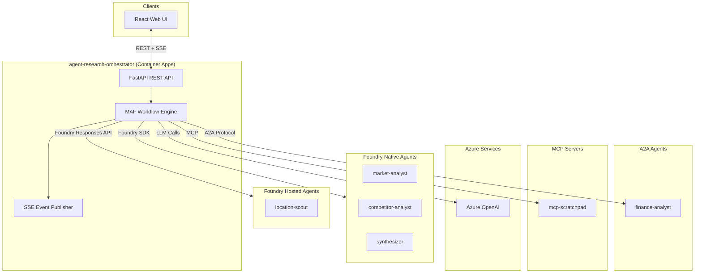
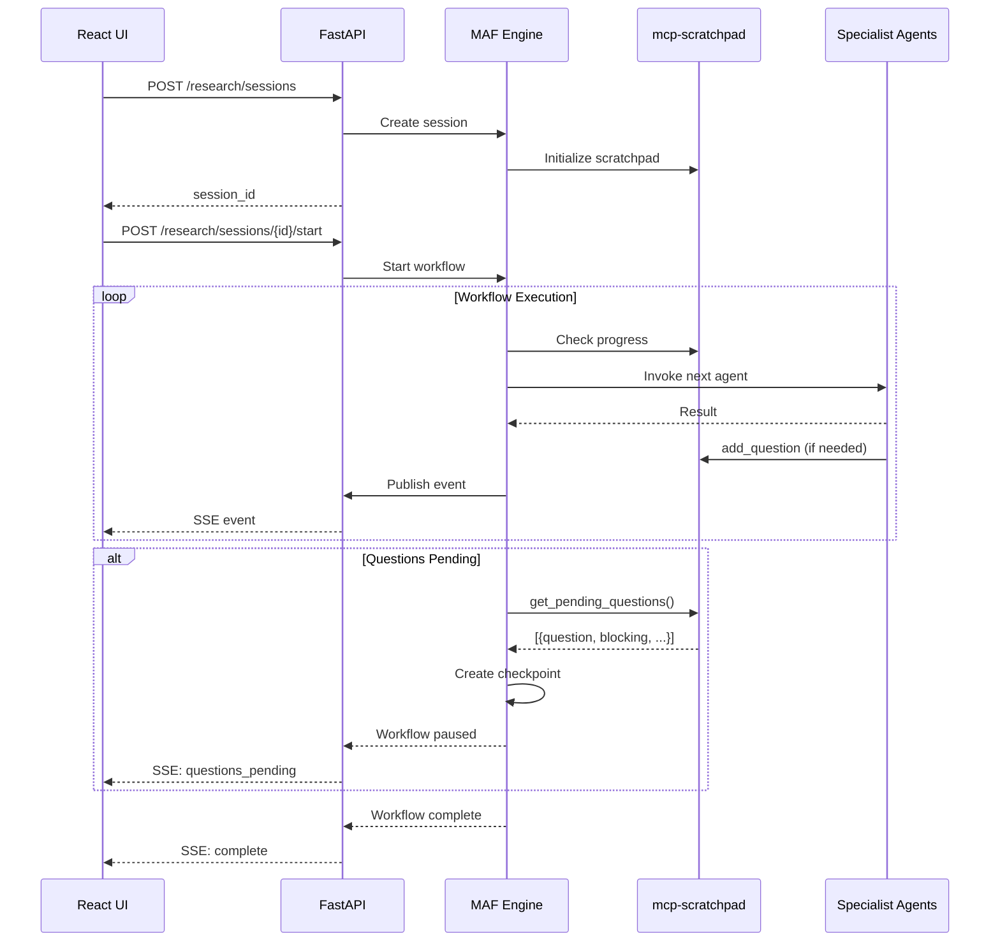
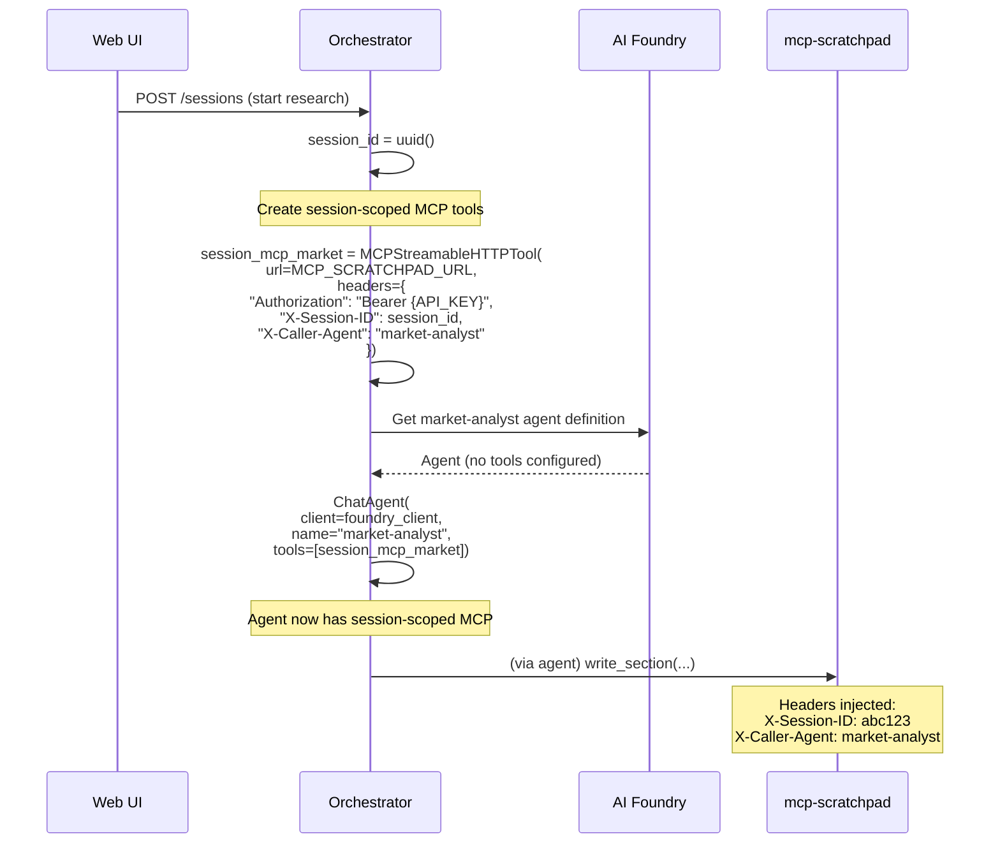
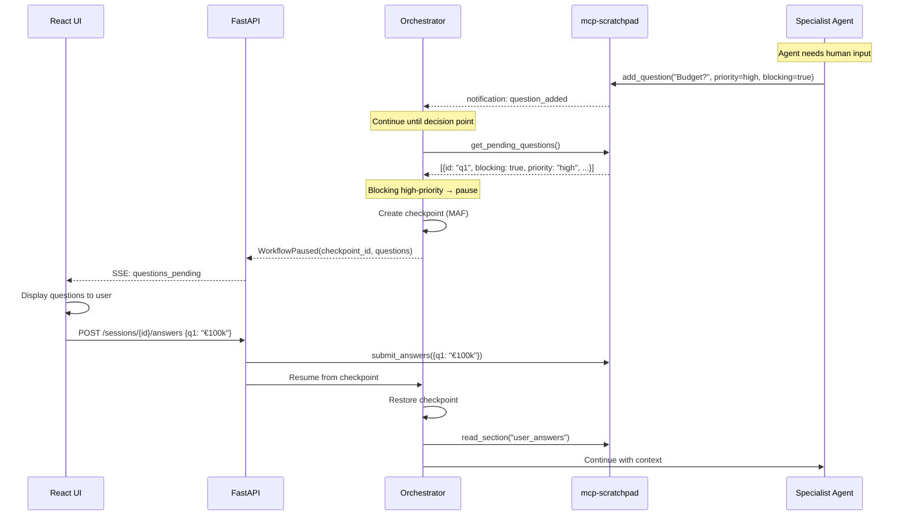
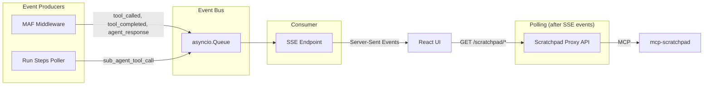
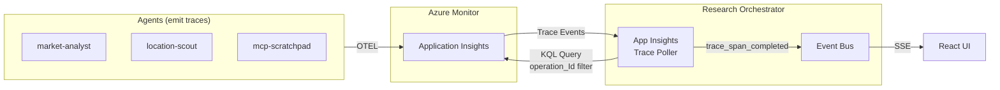
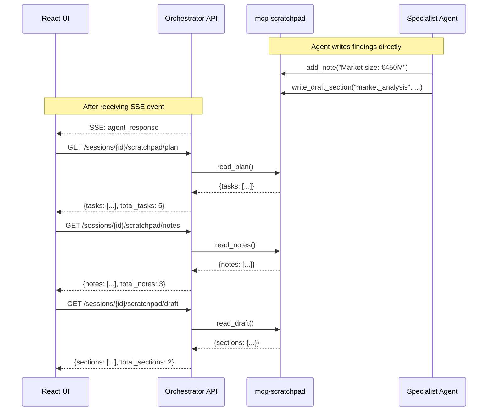

# Service Architecture: agent-research-orchestrator

Orchestrator agent for the research scenario, built with Microsoft Agent Framework (MAF) and deployed as a standalone container in Azure Container Apps.

## Context

- **Purpose**: Coordinate multi-agent research workflow, expose REST API for React web UI, orchestrate specialist agents across different deployment patterns (Foundry Native, Foundry Hosted, A2A)
- **Upstream Dependencies**: React frontend (web UI)
- **Downstream Dependencies**: 
  - `agent-market-analyst` (Foundry Native)
  - `agent-competitor-analyst` (Foundry Native)
  - `agent-location-scout` (Foundry Hosted Agent)
  - `agent-finance-analyst` (A2A Protocol)
  - `agent-synthesizer` (Foundry Native)
  - `mcp-scratchpad` (MCP Server)
  - Azure OpenAI (LLM)

## Component Diagram



## Data Flow

### Research Session Lifecycle



### Agent Invocation Patterns

| Agent | Protocol | SDK/Client | Authentication |
|-------|----------|------------|----------------|
| market-analyst | Foundry SDK | `AIProjectClient.agents` | DefaultAzureCredential |
| competitor-analyst | Foundry SDK | `AIProjectClient.agents` | DefaultAzureCredential |
| location-scout | Foundry Responses API | `openai_client.responses` | DefaultAzureCredential |
| finance-analyst | A2A Protocol | HTTP Client | Managed Identity |
| synthesizer | Foundry SDK | `AIProjectClient.agents` | DefaultAzureCredential |

## MCP Session Isolation

> **Important Architecture Decision**: MCP Scratchpad tools are NOT configured at agent provisioning time. The orchestrator injects session-scoped MCP tools at runtime.

### Problem Statement

The multi-agent research workflow requires:
1. **Session isolation**: Each research session must have isolated scratchpad data
2. **Authentication**: MCP server requires Bearer token authentication
3. **Audit trail**: Track which agent made each MCP call

### Why Runtime Injection?

**Azure AI Foundry `MCPTool` Limitation**: The Foundry SDK's `MCPTool` class does not allow sensitive headers (like `Authorization`) in agent definitions:

```python
# ❌ This FAILS at provisioning time
MCPTool(
    server_url="https://mcp-scratchpad.../mcp",
    headers={"Authorization": "Bearer ..."},  # NOT ALLOWED
)
# Error: "Headers that can include sensitive information are not allowed 
#         in the headers property for MCP tools"
```

The only alternatives are:
1. Use `project_connection_id` - requires creating Foundry connection resources
2. Pass headers via `tool_resources` at runtime - but this doesn't work for agent-as-tool pattern
3. **Orchestrator injection** - orchestrator creates MCP tools with headers and passes to agents

### Solution: Orchestrator-Managed Session Scoping



### Implementation Details

```python
# orchestrator.py - _get_session_mcp_tool()

async def _get_session_mcp_tool(
    self,
    session_id: str,
    caller_agent: str = "orchestrator",
) -> MCPStreamableHTTPTool:
    """Create session-scoped MCP tool with isolation headers.
    
    SECURITY: AI agents cannot modify these headers.
    Session ID comes from orchestrator (trusted code), not from agent.
    """
    return MCPStreamableHTTPTool(
        name=f"scratchpad-{session_id[:8]}",
        url=self.settings.mcp_scratchpad_url,
        headers={
            "Authorization": f"Bearer {self.settings.mcp_scratchpad_api_key}",
            "X-Session-ID": session_id,      # Session isolation
            "X-Caller-Agent": caller_agent,   # Audit trail
        },
    )

# When invoking specialist agents:
session_mcp_market = await self._get_session_mcp_tool(session_id, "market-analyst")
session_mcp_competitor = await self._get_session_mcp_tool(session_id, "competitor-analyst")
session_mcp_synthesizer = await self._get_session_mcp_tool(session_id, "synthesizer")

market_agent = ChatAgent(
    chat_client=foundry_client,
    name="market-analyst",
    tools=[session_mcp_market],  # Injected at runtime!
)
```

### Security Benefits

| Concern | How Addressed |
|---------|---------------|
| Cross-session data access | `X-Session-ID` header ensures agents only see their session's data |
| Credential exposure | Bearer token never stored in Foundry agent definitions |
| Agent impersonation | `X-Caller-Agent` set by orchestrator, not controllable by AI |
| Audit logging | All MCP calls tagged with session + caller for compliance |

### Implications for Agent Provisioning

Foundry Native agents (market-analyst, competitor-analyst, synthesizer) are provisioned **without MCP tools**:

```python
# provision.py - What gets stored in AI Foundry
agent = client.agents.create(
    name="market-analyst",
    definition=PromptAgentDefinition(
        model="gpt-5",
        instructions=SYSTEM_PROMPT,
        # NO tools here - orchestrator provides them at runtime
    ),
)
```

See individual agent specs for more details:
- `specs/services/agent-market-analyst/ARCHITECTURE.md`
- `specs/services/agent-competitor-analyst/ARCHITECTURE.md`
- `specs/services/agent-synthesizer/ARCHITECTURE.md`

## Human-in-the-Loop Architecture

The orchestrator supports pausing for human input using MAF's checkpointing mechanism combined with the scratchpad question queue.

### Question Queue Pattern

Agents add questions to the scratchpad; the orchestrator decides when to pause based on question priority and blocking status.



### When to Pause

The orchestrator uses these heuristics to decide when to pause for human input:

| Condition | Action |
|-----------|--------|
| Any `blocking=true` + `priority=high` question | Pause immediately |
| Phase boundary (e.g., market→competitor→finance) | Check for accumulated questions |
| Agent output contains "need human input" | Pause after that agent |
| More than 3 unanswered questions | Pause at next agent boundary |

### Checkpoint Management

MAF provides automatic checkpointing at workflow boundaries:

```python
# Workflow pauses and creates checkpoint
checkpoint_info = await workflow.create_checkpoint()

# Later, resume from checkpoint
await workflow.resume_from_checkpoint(
    checkpoint_id=checkpoint_info.checkpoint_id,
    context={"user_answers": answers}
)
```

### API Endpoints for HITL

| Endpoint | Method | Description |
|----------|--------|-------------|
| `POST /sessions/{id}/answers` | POST | Submit answers to pending questions |
| `GET /sessions/{id}/questions` | GET | Get current pending questions |
| `POST /sessions/{id}/resume` | POST | Resume paused workflow |
| `GET /sessions/{id}/checkpoint` | GET | Get current checkpoint status |

## Event Streaming Architecture

The orchestrator uses an internal event bus pattern with `asyncio.Queue` to unify multiple event sources into a single SSE stream for the UI.

### Event Sources



> **Design Decision**: Scratchpad state is fetched via polling rather than SSE because subagents invoke MCP tools directly, bypassing the orchestrator's event middleware.

### Event Flow

1. **MAF Middleware Events**: Intercepts tool calls to specialist agents (market-analyst, competitor-analyst, etc.) using `FunctionInvocationContext` middleware
2. **Run Steps Events**: Polls `run_steps.list()` API on Foundry agents to capture their internal tool calls (web search, calculator, etc.)
3. **MCP Scratchpad Events**: Subscribes to `mcp-scratchpad` notifications to stream scratchpad changes in real-time
4. **Application Insights Trace Events**: Polls App Insights for traces matching the session's `operation_Id` to capture subagent tool calls (see ADR-005)

### Application Insights Trace Polling (ADR-005)

> **Background**: Azure AI Foundry Hosted Agents execute tools server-side. MAF's `stream_callback` only receives text tokens, not `FunctionCallContent`. Therefore, we poll Application Insights for traces to get visibility into subagent tool calls.

See `specs/platform/decisions/ADR-005-realtime-agent-observability.md` for full architecture decision.



#### Trace Polling Implementation

```python
# orchestrator.py - integrate trace polling

class AppInsightsTracePoller:
    """Polls Application Insights for traces matching session operation_Id."""
    
    def __init__(self, workspace_id: str):
        self.client = LogsQueryClient(DefaultAzureCredential())
        self.workspace_id = workspace_id
    
    async def poll_session_traces(
        self,
        operation_id: str,
        since: datetime
    ) -> list[dict]:
        query = f"""
        union traces, dependencies
        | where operation_Id == '{operation_id}'
        | where timestamp > datetime({since.isoformat()}Z)
        | project timestamp, name, duration, customDimensions, success
        | order by timestamp asc
        """
        result = await self.client.query_workspace(
            self.workspace_id, query, timespan=timedelta(minutes=30)
        )
        return [dict(zip(result.tables[0].columns, row)) 
                for row in result.tables[0].rows]
```

#### SSE Events from Traces

| Event Type | Source | Payload |
|------------|--------|---------|
| `trace_span_started` | Trace Poller | `{span_name, agent_name, operation_id, timestamp}` |
| `trace_span_completed` | Trace Poller | `{span_name, agent_name, duration_ms, success}` |
| `trace_tool_call` | Trace Poller | `{tool_name, mcp_server, agent_name, arguments_preview}` |

#### Latency Expectations

- App Insights ingestion: 2-5 seconds
- Polling interval: 2 seconds
- Total trace event latency: **3-8 seconds**

### MCP Scratchpad Integration

The orchestrator provides proxy endpoints for the frontend to poll scratchpad state. This is necessary because subagents invoke MCP tools directly (not through the orchestrator's middleware), so SSE events from subagent scratchpad writes are not reliably captured.



#### Scratchpad Polling Endpoints

| Endpoint | Method | Description |
|----------|--------|-------------|
| `/sessions/{id}/scratchpad/plan` | GET | Get all tasks with IDs, statuses, assignments |
| `/sessions/{id}/scratchpad/notes` | GET | Get all notes with authors and content |
| `/sessions/{id}/scratchpad/draft` | GET | Get all draft sections |

### SSE Event Types

> **Note**: Scratchpad state events (`scratchpad_updated`, `scratchpad_snapshot`) are deprecated. Frontend should poll scratchpad endpoints after receiving key events.

| Event Type | Source | Payload |
|------------|--------|---------|
| `workflow_started` | Orchestrator | `{session_id, query}` |
| `agent_invoked` | MAF Middleware | `{agent_name, input_preview}` |
| `agent_completed` | MAF Middleware | `{agent_name, output_preview, duration_ms}` |
| `sub_agent_tool_call` | Run Steps Poller | `{agent_name, tool_name, arguments, output}` |
| `agent_response` | Orchestrator | `{agent_name, response_summary, execution_time_ms}` |
| `scratchpad_updated` | MCP Subscription | `{section_name, content_preview, status, version}` (DEPRECATED) |
| `question_added` | MCP Subscription | `{question_id, question, asked_by, priority, blocking}` |
| `questions_pending` | Orchestrator | `{checkpoint_id, questions: [...], can_continue: bool}` |
| `workflow_paused` | Orchestrator | `{checkpoint_id, reason, pending_questions_count}` |
| `workflow_resumed` | Orchestrator | `{checkpoint_id, answers_provided: int}` |
| `thinking` | Orchestrator | `{content}` |
| `workflow_completed` | Orchestrator | `{session_id, final_report}` |
| `error` | Any | `{error_type, message, recoverable}` |

### Implementation Notes

- Event queue has max size of 1000 to prevent memory issues
- Events include monotonic sequence numbers for ordering
- SSE endpoint uses `async for` to drain queue
- Graceful shutdown waits for queue to drain (max 5s)

## Cross-Cutting Concerns

### Resilience Tactics
- **Retry with exponential backoff** for all agent invocations (max 3 retries)
- **Circuit breaker** pattern for A2A calls to finance-analyst
- **Timeout**: 60s per agent invocation, 5min total workflow
- **Fallback**: Pre-recorded demo responses for critical failures

### Performance Targets
| Metric | Target |
|--------|--------|
| API response time (non-streaming) | < 200ms |
| SSE event latency | < 500ms |
| Full workflow completion | < 3 minutes |
| Agent invocation overhead | < 100ms |

### Compliance/Residency
- All data processed in West Europe region
- No PII stored (demo data only)
- Logs retained for 7 days

## Technology Stack

| Component | Technology | Version |
|-----------|------------|---------|
| Framework | Microsoft Agent Framework | latest |
| API | FastAPI | ^0.115.0 |
| Async | asyncio, httpx | - |
| Azure SDK | azure-ai-projects | ^2.0.0 |
| Telemetry | azure-monitor-query, azure-monitor-opentelemetry | ^1.3.0, ^1.6.0 |
| Validation | Pydantic | ^2.5.0 |
| Streaming | sse-starlette | ^2.0.0 |

## ADR References

- ADR-001: Use MAF for orchestration (pending)
- ADR-002: REST+SSE over WebSocket for web UI (pending)
- ADR-003: A2A for cross-platform agent communication (pending)
- **ADR-005: Real-time Agent Observability via OpenTelemetry and Application Insights** - See `specs/platform/decisions/ADR-005-realtime-agent-observability.md`
