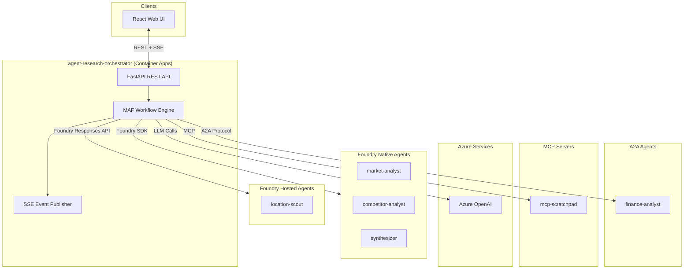
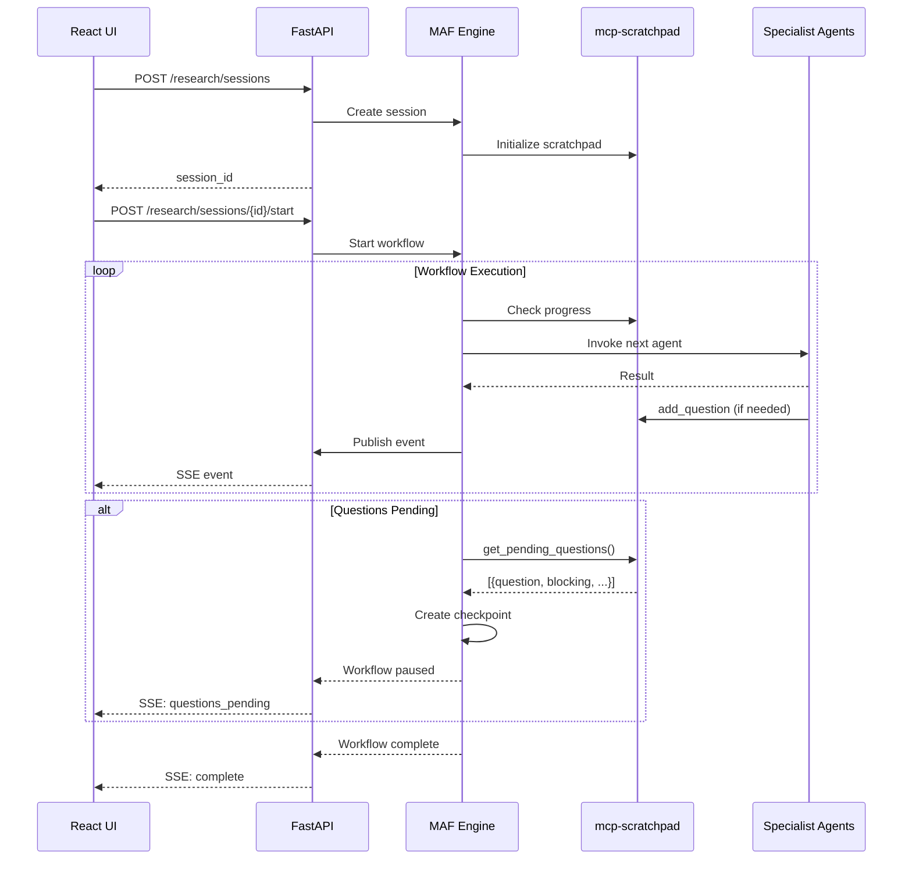
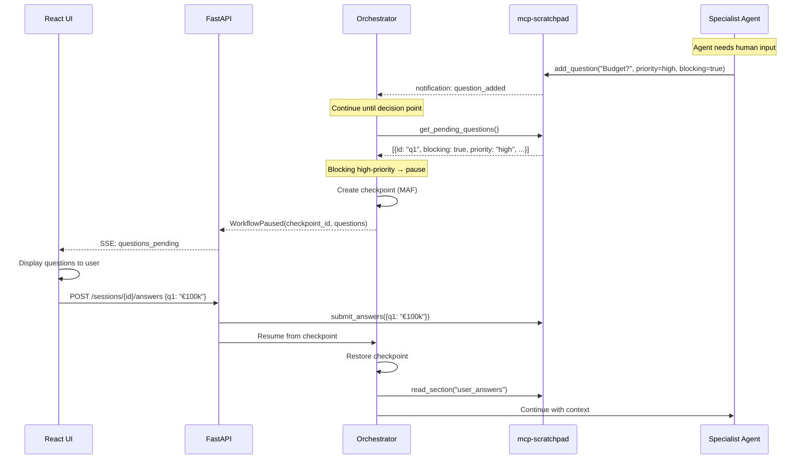
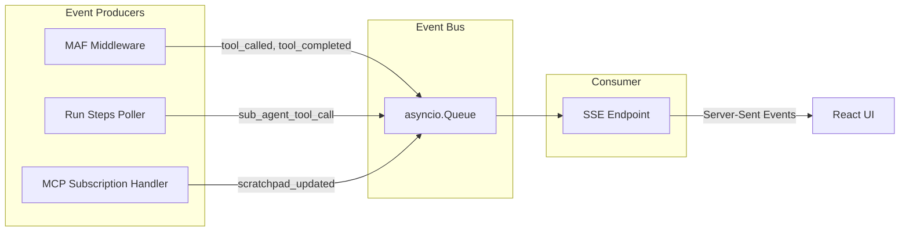
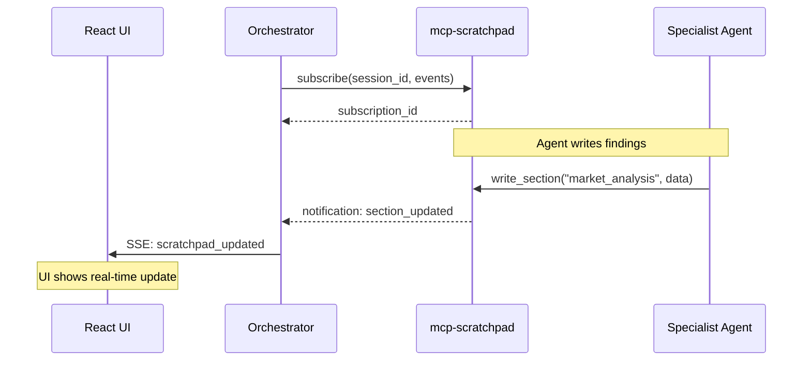

# Service Architecture: agent-research-orchestrator

Orchestrator agent for the research scenario, built with Microsoft Agent Framework (MAF) and deployed as a standalone container in Azure Container Apps.

## Context

- **Purpose**: Coordinate multi-agent research workflow, expose REST API for React web UI, orchestrate specialist agents across different deployment patterns (Foundry Native, Foundry Hosted, A2A)
- **Upstream Dependencies**: React frontend (web UI)
- **Downstream Dependencies**: 
  - `agent-market-analyst` (Foundry Native)
  - `agent-competitor-analyst` (Foundry Native)
  - `agent-location-scout` (Foundry Hosted Agent)
  - `agent-finance-analyst` (A2A Protocol)
  - `agent-synthesizer` (Foundry Native)
  - `mcp-scratchpad` (MCP Server)
  - Azure OpenAI (LLM)

## Component Diagram



## Data Flow

### Research Session Lifecycle



### Agent Invocation Patterns

| Agent | Protocol | SDK/Client | Authentication |
|-------|----------|------------|----------------|
| market-analyst | Foundry SDK | `AIProjectClient.agents` | DefaultAzureCredential |
| competitor-analyst | Foundry SDK | `AIProjectClient.agents` | DefaultAzureCredential |
| location-scout | Foundry Responses API | `openai_client.responses` | DefaultAzureCredential |
| finance-analyst | A2A Protocol | HTTP Client | Managed Identity |
| synthesizer | Foundry SDK | `AIProjectClient.agents` | DefaultAzureCredential |

## Human-in-the-Loop Architecture

The orchestrator supports pausing for human input using MAF's checkpointing mechanism combined with the scratchpad question queue.

### Question Queue Pattern

Agents add questions to the scratchpad; the orchestrator decides when to pause based on question priority and blocking status.



### When to Pause

The orchestrator uses these heuristics to decide when to pause for human input:

| Condition | Action |
|-----------|--------|
| Any `blocking=true` + `priority=high` question | Pause immediately |
| Phase boundary (e.g., market→competitor→finance) | Check for accumulated questions |
| Agent output contains "need human input" | Pause after that agent |
| More than 3 unanswered questions | Pause at next agent boundary |

### Checkpoint Management

MAF provides automatic checkpointing at workflow boundaries:

```python
# Workflow pauses and creates checkpoint
checkpoint_info = await workflow.create_checkpoint()

# Later, resume from checkpoint
await workflow.resume_from_checkpoint(
    checkpoint_id=checkpoint_info.checkpoint_id,
    context={"user_answers": answers}
)
```

### API Endpoints for HITL

| Endpoint | Method | Description |
|----------|--------|-------------|
| `POST /sessions/{id}/answers` | POST | Submit answers to pending questions |
| `GET /sessions/{id}/questions` | GET | Get current pending questions |
| `POST /sessions/{id}/resume` | POST | Resume paused workflow |
| `GET /sessions/{id}/checkpoint` | GET | Get current checkpoint status |

## Event Streaming Architecture

The orchestrator uses an internal event bus pattern with `asyncio.Queue` to unify multiple event sources into a single SSE stream for the UI.

### Event Sources



### Event Flow

1. **MAF Middleware Events**: Intercepts tool calls to specialist agents (market-analyst, competitor-analyst, etc.) using `FunctionInvocationContext` middleware
2. **Run Steps Events**: Polls `run_steps.list()` API on Foundry agents to capture their internal tool calls (web search, calculator, etc.)
3. **MCP Scratchpad Events**: Subscribes to `mcp-scratchpad` notifications to stream scratchpad changes in real-time

### MCP Scratchpad Integration

The orchestrator subscribes to scratchpad notifications to provide real-time visibility into inter-agent communication:



### SSE Event Types

| Event Type | Source | Payload |
|------------|--------|---------|
| `workflow_started` | Orchestrator | `{session_id, query}` |
| `agent_invoked` | MAF Middleware | `{agent_name, input_preview}` |
| `agent_completed` | MAF Middleware | `{agent_name, output_preview, duration_ms}` |
| `sub_agent_tool_call` | Run Steps Poller | `{agent_name, tool_name, arguments, output}` |
| `scratchpad_updated` | MCP Subscription | `{section_name, content_preview, status, version}` |
| `question_added` | MCP Subscription | `{question_id, question, asked_by, priority, blocking}` |
| `questions_pending` | Orchestrator | `{checkpoint_id, questions: [...], can_continue: bool}` |
| `workflow_paused` | Orchestrator | `{checkpoint_id, reason, pending_questions_count}` |
| `workflow_resumed` | Orchestrator | `{checkpoint_id, answers_provided: int}` |
| `thinking` | Orchestrator | `{content}` |
| `workflow_completed` | Orchestrator | `{session_id, final_report}` |
| `error` | Any | `{error_type, message, recoverable}` |

### Implementation Notes

- Event queue has max size of 1000 to prevent memory issues
- Events include monotonic sequence numbers for ordering
- SSE endpoint uses `async for` to drain queue
- Graceful shutdown waits for queue to drain (max 5s)

## Cross-Cutting Concerns

### Resilience Tactics
- **Retry with exponential backoff** for all agent invocations (max 3 retries)
- **Circuit breaker** pattern for A2A calls to finance-analyst
- **Timeout**: 60s per agent invocation, 5min total workflow
- **Fallback**: Pre-recorded demo responses for critical failures

### Performance Targets
| Metric | Target |
|--------|--------|
| API response time (non-streaming) | < 200ms |
| SSE event latency | < 500ms |
| Full workflow completion | < 3 minutes |
| Agent invocation overhead | < 100ms |

### Compliance/Residency
- All data processed in West Europe region
- No PII stored (demo data only)
- Logs retained for 7 days

## Technology Stack

| Component | Technology | Version |
|-----------|------------|---------|
| Framework | Microsoft Agent Framework | latest |
| API | FastAPI | ^0.115.0 |
| Async | asyncio, httpx | - |
| Azure SDK | azure-ai-projects | ^2.0.0 |
| Validation | Pydantic | ^2.5.0 |
| Streaming | sse-starlette | ^2.0.0 |

## ADR References

- ADR-001: Use MAF for orchestration (pending)
- ADR-002: REST+SSE over WebSocket for web UI (pending)
- ADR-003: A2A for cross-platform agent communication (pending)
