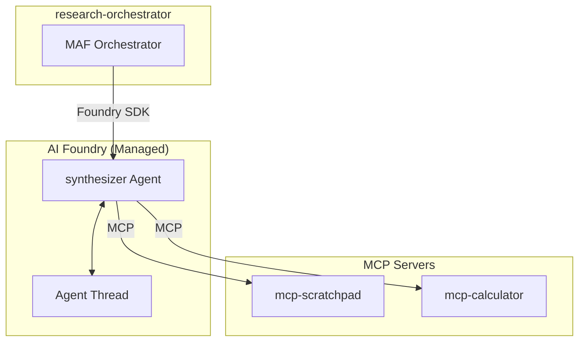

# Service Architecture: agent-synthesizer

Foundry Native prompt-based agent for research synthesis.

## Context

- **Purpose**: Synthesize findings from all agents into cohesive expansion recommendation
- **Upstream Dependencies**: research-orchestrator (via Foundry SDK)
- **Downstream Dependencies**: 
  - `mcp-scratchpad` (MCP Server) - read all agent findings
  - `mcp-calculator` (MCP Server) - validate financial projections
  - Azure OpenAI (LLM - Foundry managed)

## Component Diagram



## Agent Definition

### System Prompt
```
You are a senior business analyst specializing in synthesizing research findings
into actionable expansion recommendations for the coffee industry.

Tasks:
1. Read all findings from the scratchpad (market, competitor, location, financial)
2. Identify patterns and correlations across analyses
3. Assess overall viability
4. Generate prioritized recommendations
5. Write final synthesis to scratchpad

Always:
- Read all available sections from scratchpad before starting
- Cross-reference findings between different analyses
- Provide balanced assessment with pros and cons
- Deliver clear, actionable recommendations
- Update checklist when complete
```

### MCP Tools
| Tool | Server | Purpose |
|------|--------|---------|
| `read_section` | mcp-scratchpad | Read all agent findings |
| `write_section` | mcp-scratchpad | Store synthesis |
| `update_checklist` | mcp-scratchpad | Update progress |
| `list_sections` | mcp-scratchpad | List available findings |
| `calculate_roi` | mcp-calculator | Validate ROI calculations |
| `sensitivity_analysis` | mcp-calculator | Risk scenario analysis |

## Performance Targets
| Metric | Target |
|--------|--------|
| Agent execution time | < 45s |
| MCP tool call latency | < 5s |

## Provisioning

Agent is provisioned via Python script using `azure-ai-projects` SDK:

```python
agent = client.agents.create(
    name="synthesizer",
    definition=PromptAgentDefinition(
        model="gpt-4o",
        instructions=SYSTEM_PROMPT,
        # NOTE: No tools configured here - see MCP Session Isolation below
    ),
    description="Senior business analyst for research synthesis"
)
```

## MCP Session Isolation

> **Important Architecture Decision**: MCP tools are NOT configured at agent provisioning time.

### Why Not Provision-Time MCP?

1. **Azure AI Foundry Limitation**: The `MCPTool` class does not allow sensitive headers (like `Authorization`) in the agent definition. You must use `project_connection_id` or pass headers via `tool_resources` at runtime.

2. **Session Isolation Requirement**: Each research session needs a unique `X-Session-ID` header to isolate scratchpad data. This session ID is only known at runtime when the orchestrator creates a research session.

3. **Audit Trail**: The `X-Caller-Agent` header identifies which agent made each MCP call, enabling proper audit logging.

### How It Works

The orchestrator creates session-scoped MCP tools at runtime and injects them when invoking this agent:

```python
# In orchestrator (runtime)
session_mcp_synthesizer = MCPStreamableHTTPTool(
    url=mcp_scratchpad_url,
    headers={
        "Authorization": f"Bearer {api_key}",
        "X-Session-ID": session_id,
        "X-Caller-Agent": "synthesizer",
    },
)

# Agent invoked with session-scoped tools
agent = ChatAgent(
    chat_client=foundry_client,
    name="synthesizer",
    tools=[session_mcp_synthesizer],  # Injected at runtime
)
```

See `agent-research-orchestrator/ARCHITECTURE.md` for full details on session isolation.
