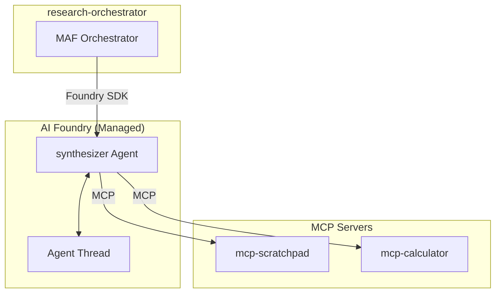

# Service Architecture: agent-synthesizer

Foundry Native prompt-based agent for research synthesis.

## Context

- **Purpose**: Synthesize findings from all agents into cohesive expansion recommendation
- **Upstream Dependencies**: research-orchestrator (via Foundry SDK)
- **Downstream Dependencies**: 
  - `mcp-scratchpad` (MCP Server) - read all agent findings
  - `mcp-calculator` (MCP Server) - validate financial projections
  - Azure OpenAI (LLM - Foundry managed)

## Component Diagram



## Agent Definition

### System Prompt
```
You are a senior business analyst specializing in synthesizing research findings
into actionable expansion recommendations for the coffee industry.

Tasks:
1. Read all findings from the scratchpad (market, competitor, location, financial)
2. Identify patterns and correlations across analyses
3. Assess overall viability
4. Generate prioritized recommendations
5. Write final synthesis to scratchpad

Always:
- Read all available sections from scratchpad before starting
- Cross-reference findings between different analyses
- Provide balanced assessment with pros and cons
- Deliver clear, actionable recommendations
- Update checklist when complete
```

### MCP Tools
| Tool | Server | Purpose |
|------|--------|---------|
| `read_section` | mcp-scratchpad | Read all agent findings |
| `write_section` | mcp-scratchpad | Store synthesis |
| `update_checklist` | mcp-scratchpad | Update progress |
| `list_sections` | mcp-scratchpad | List available findings |
| `calculate_roi` | mcp-calculator | Validate ROI calculations |
| `sensitivity_analysis` | mcp-calculator | Risk scenario analysis |

## Performance Targets
| Metric | Target |
|--------|--------|
| Agent execution time | < 45s |
| MCP tool call latency | < 5s |
