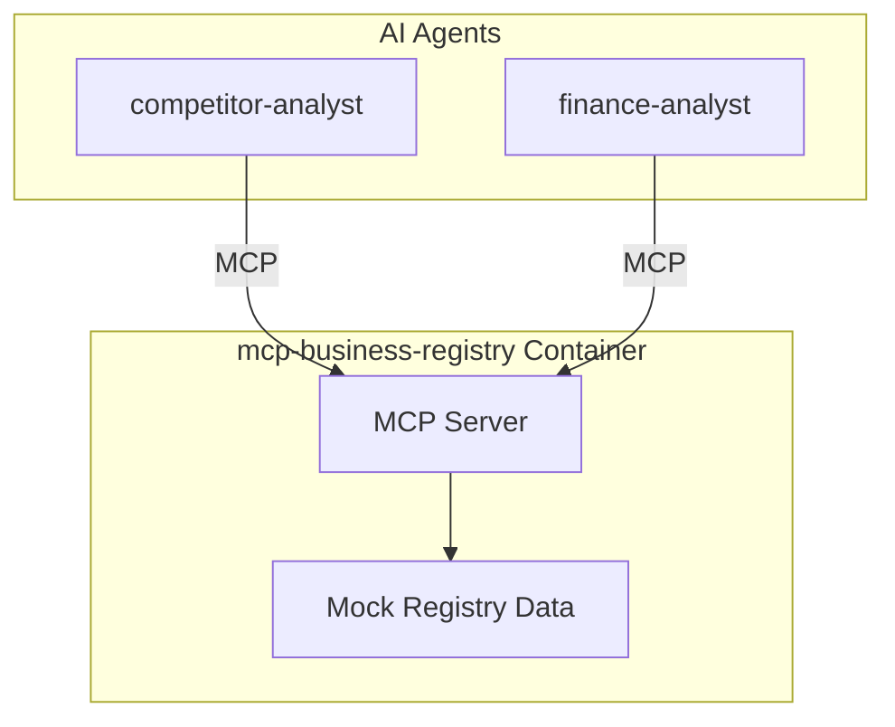

# Service Architecture: mcp-business-registry

MCP Server providing business and company registry data.

## Context

- **Purpose**: Search companies, get business profiles, financial data, ownership info
- **Used By**: competitor-analyst, finance-analyst
- **Downstream Dependencies**: Container Apps Environment (mock data in demo)

## Component Diagram

## MCP Tools

| Tool | Description |
|------|-------------|
| `search_companies` | Search business registry by name, industry, location |
| `get_company_profile` | Get detailed company information |
| `get_company_financials` | Get revenue, employee count, growth data |
| `get_company_locations` | Get list of company locations/branches |
| `get_industry_players` | Get top companies in an industry/region |
| `get_company_news` | Get recent news about a specific company |

## Technology Choices

| Component | Choice | Rationale |
|-----------|--------|-----------|
| Runtime | Python 3.11 | Team familiarity |
| MCP SDK | `mcp[server]` | Official SDK |
| Data | Mock responses | Demo (would use Crunchbase/D&B API in prod) |

## Performance Targets
| Metric | Target |
|--------|--------|
| Tool call latency | < 150ms (p95) |
