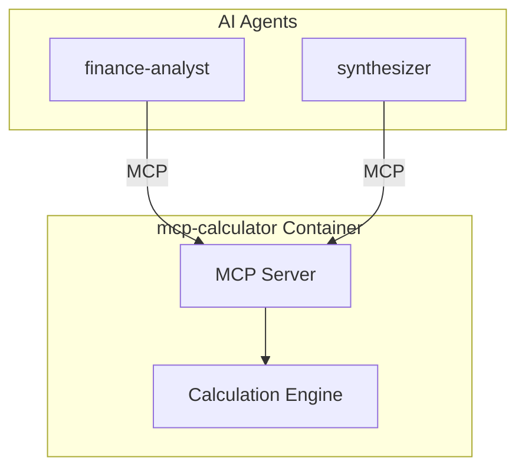

# Service Architecture: mcp-calculator

MCP Server providing financial calculations (pure computation, no data).

## Context

- **Purpose**: Financial calculations, projections, ROI analysis
- **Used By**: finance-analyst, synthesizer
- **Downstream Dependencies**: None (pure computation)

## Component Diagram

## MCP Tools

| Tool | Description |
|------|-------------|
| `calculate_startup_costs` | Calculate total startup investment |
| `calculate_operating_costs` | Calculate monthly operating costs |
| `calculate_break_even` | Break-even analysis |
| `calculate_roi` | Return on investment calculation |
| `project_revenue` | Multi-year revenue projections |
| `project_cash_flow` | Cash flow projections |
| `calculate_npv` | Net present value calculation |
| `sensitivity_analysis` | Sensitivity analysis on key variables |

## Technology Choices

| Component | Choice | Rationale |
|-----------|--------|-----------|
| Runtime | Python 3.11 | Team familiarity |
| MCP SDK | `mcp[server]` | Official SDK |
| Computation | NumPy/Pandas | Financial calculations |

## Performance Targets
| Metric | Target |
|--------|--------|
| Tool call latency | < 50ms (p95) |
