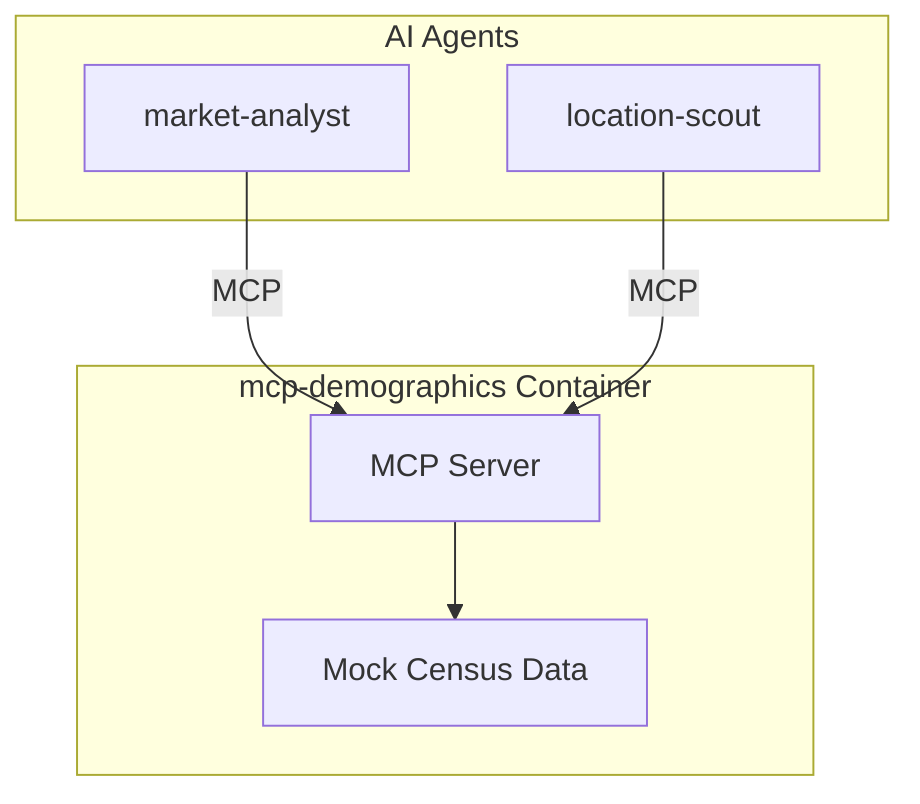

# Service Architecture: mcp-demographics

MCP Server providing demographic and consumer data.

## Context

- **Purpose**: Population statistics, income data, consumer behavior insights
- **Used By**: market-analyst, location-scout
- **Downstream Dependencies**: Container Apps Environment (mock data in demo)

## Component Diagram

## MCP Tools

| Tool | Description |
|------|-------------|
| `get_population_stats` | Population, density, growth trends |
| `get_income_distribution` | Income brackets, purchasing power |
| `get_age_distribution` | Age demographics |
| `get_consumer_spending` | Spending patterns by category |
| `get_lifestyle_segments` | Consumer lifestyle segmentation |
| `get_commuter_patterns` | Commuter and traffic patterns |

## Technology Choices

| Component | Choice | Rationale |
|-----------|--------|-----------|
| Runtime | Python 3.11 | Team familiarity |
| MCP SDK | `mcp[server]` | Official SDK |
| Data | Mock responses | Demo (would use census APIs in prod) |

## Performance Targets
| Metric | Target |
|--------|--------|
| Tool call latency | < 100ms (p95) |
