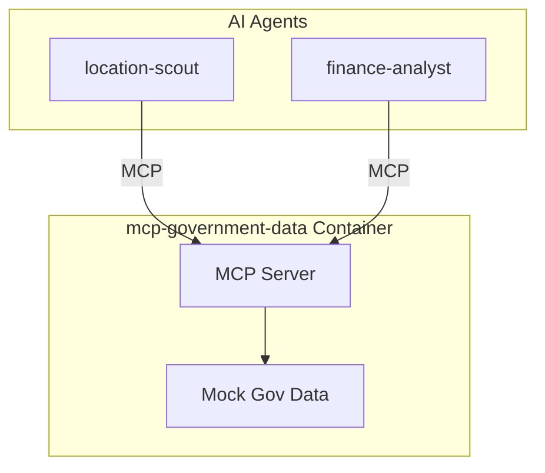

# Service Architecture: mcp-government-data

MCP Server providing government/regulatory data.

## Context

- **Purpose**: Access permits, zoning, regulations, tax info from government sources
- **Used By**: location-scout, finance-analyst
- **Downstream Dependencies**: Container Apps Environment (mock data in demo)

## Component Diagram

## MCP Tools

| Tool | Description |
|------|-------------|
| `get_business_permits` | Required permits for business type |
| `get_zoning_info` | Zoning classification and restrictions |
| `get_regulations` | Industry-specific regulations |
| `get_tax_rates` | Business taxes by location |
| `get_licensing_requirements` | Professional licenses needed |
| `get_health_safety_codes` | Food service health codes |
| `get_labor_laws` | Employment regulations |

## Technology Choices

| Component | Choice | Rationale |
|-----------|--------|-----------|
| Runtime | Python 3.11 | Team familiarity |
| MCP SDK | `mcp[server]` | Official SDK |
| Data | Mock responses | Demo (would scrape gov sites in prod) |

## Performance Targets
| Metric | Target |
|--------|--------|
| Tool call latency | < 100ms (p95) |
