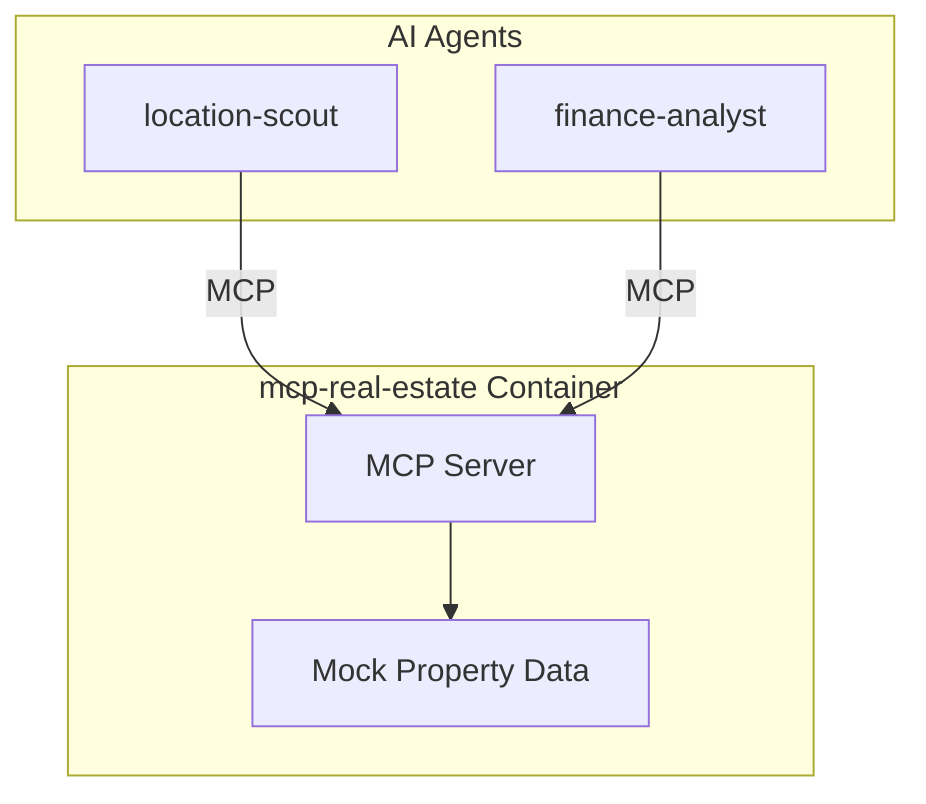

# Service Architecture: mcp-real-estate

MCP Server providing real estate and location data.

## Context

- **Purpose**: Property listings, rental rates, foot traffic, location scoring
- **Used By**: location-scout, finance-analyst
- **Downstream Dependencies**: Container Apps Environment (mock data in demo)

## Component Diagram

## MCP Tools

| Tool | Description |
|------|-------------|
| `search_commercial_properties` | Find available commercial spaces |
| `get_rental_rates` | Get rental rates by area |
| `get_foot_traffic` | Get pedestrian traffic data |
| `get_nearby_amenities` | Get nearby businesses, transit, etc. |
| `get_location_score` | Get walkability, transit, business scores |
| `get_vacancy_rates` | Get commercial vacancy rates |
| `compare_locations` | Compare multiple locations |

## Technology Choices

| Component | Choice | Rationale |
|-----------|--------|-----------|
| Runtime | Python 3.11 | Team familiarity |
| MCP SDK | `mcp[server]` | Official SDK |
| Data | Mock responses | Demo (would use CoStar/LoopNet APIs in prod) |

## Performance Targets
| Metric | Target |
|--------|--------|
| Tool call latency | < 150ms (p95) |
