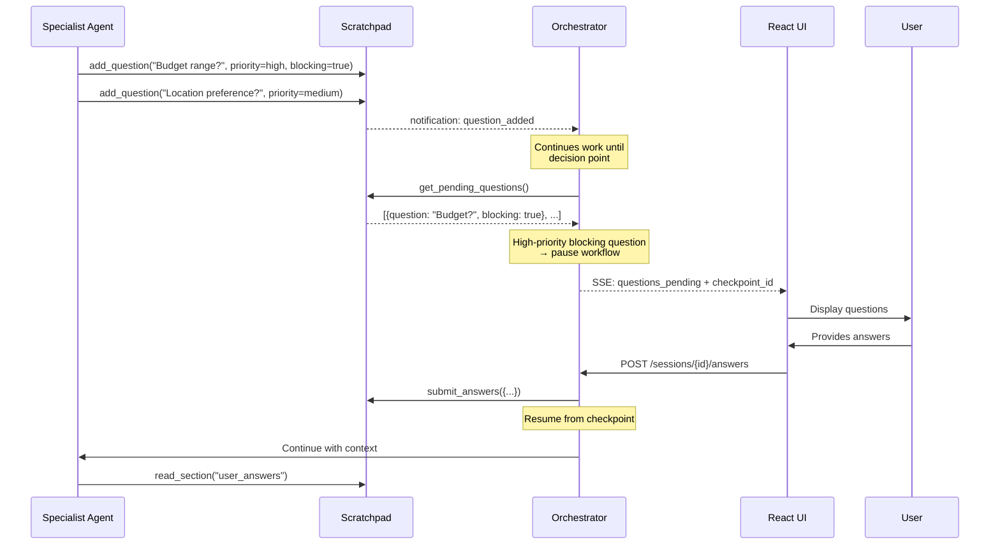
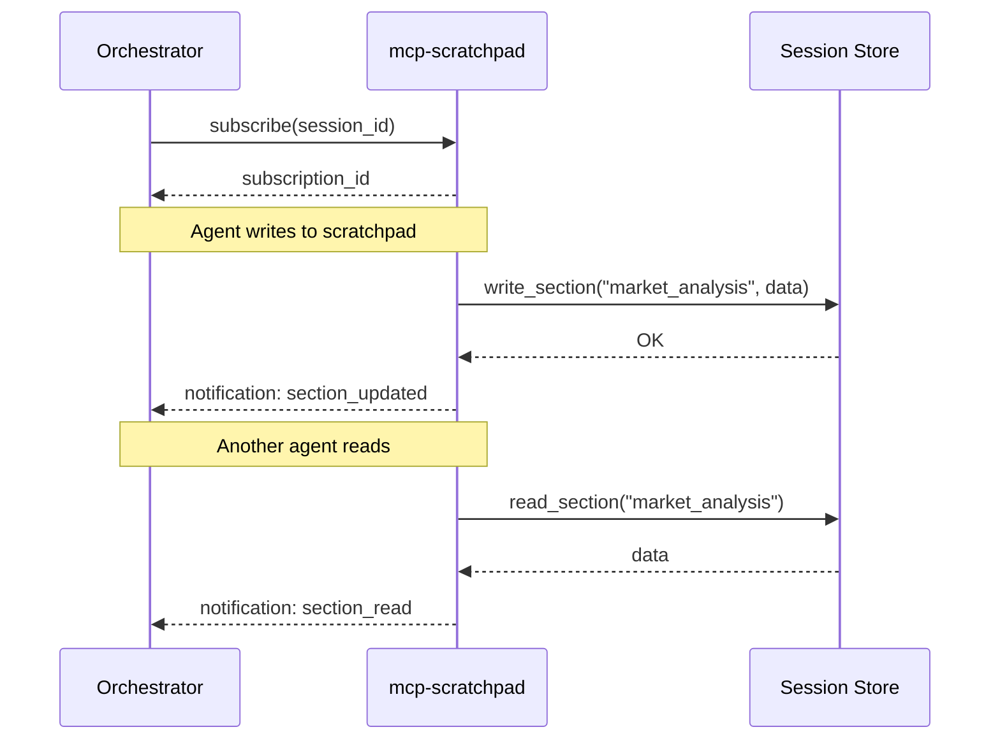

# Service Architecture: mcp-scratchpad

MCP Server providing shared workspace for inter-agent communication and collaborative document creation.

## Context

- **Purpose**: Shared memory/scratchpad for agents to collaborate on research findings, build working documents, track progress, and queue questions for human review
- **Upstream Dependencies**: None
- **Downstream Dependencies**: 
  - Container Apps Environment (deployment)

> **Note (Demo Phase)**: Data is stored in-memory only. Sessions are lost on service restart. Cosmos DB persistence planned for production.

## Design Philosophy

### The "Shared Brain" Workspace

The scratchpad is designed as a **collaborative workspace** that mimics how a human team works on a project. It is divided into three distinct pillars:

| Pillar | Metaphor | Purpose | Characteristics |
|--------|----------|---------|-----------------|
| **NOTES** | The Corkboard | Raw facts, findings, URLs, and snippets found during research. | Unstructured, append-only, searchable, atomic. |
| **DRAFT** | The Manuscript | The structured deliverable being built (e.g., the final report). | Structured, versioned, overwritable sections. |
| **PLAN** | The Checklist | The shared to-do list coordinating the team's efforts. | Dynamic, status-tracking, dependency-aware. |

### Agent Inputs/Outputs vs. Scratchpad

| Concept | Purpose | Example |
|---------|---------|---------|
| **Agent Input** | Concise task instruction from orchestrator | "Analyze coffee market in Prague, check the Notes for existing data." |
| **Agent Output** | Status + key insights summary | "Task complete. Added 5 notes and updated the 'Market' draft section." |
| **Scratchpad** | The actual work product and shared context | The full list of competitor prices (Notes) and the written analysis (Draft). |

## Component Diagram

```mermaid
flowchart TB
    subgraph Agents["AI Agents"]
        MA[market-analyst]
        CA[competitor-analyst]
        LS[location-scout]
        FA[finance-analyst]
        SY[synthesizer]
    end
    
    subgraph MCP["mcp-scratchpad Container"]
        Server[MCP Server]
        Store[In-Memory Store]
        
        subgraph Workspace["Workspace State"]
            Notes[Notes (Corkboard)]
            Draft[Draft (Manuscript)]
            Plan[Plan (Checklist)]
        end
    end
    
    subgraph Orchestrator["Orchestrator"]
        Orch[research-orchestrator]
    end
    
    MA & CA & LS & FA & SY -->|MCP Tools| Server
    Server --> Store
    Store --> Workspace
    
    MA -->|add_note| Notes
    SY -->|read_notes| Notes
    SY -->|write_draft_section| Draft
    Orch -->|add_task| Plan
```

## MCP Tools

### Notes (The Corkboard)

| Tool | Description |
|------|-------------|
| `add_note` | Add a raw finding, fact, or URL to the workspace |
| `read_notes` | Search and filter notes by tag or content |

### Draft (The Manuscript)

| Tool | Description |
|------|-------------|
| `write_draft_section` | Write or overwrite a structured section of the report |
| `read_draft` | Read the current state of the draft (full or specific section) |

### Plan (The Checklist)

| Tool | Description |
|------|-------------|
| `add_task` | Add a new task to the plan |
| `update_task` | Update status or assignment of a task |
| `read_plan` | Get the current state of the plan |

## Workspace Structure

The workspace state is a single cohesive object containing the three pillars:

```json
{
  "notes": [
    {
      "id": "n1",
      "content": "Competitor X charges $10/mo",
      "tags": ["pricing", "competitor"],
      "author": "market-analyst",
      "timestamp": "..."
    }
  ],
  "draft_sections": {
    "executive_summary": {
      "title": "Executive Summary",
      "content": "...",
      "version": 2
    }
  },
  "plan": [
    {
      "id": "t1",
      "description": "Analyze market size",
      "status": "completed",
      "assigned_to": "market-analyst"
    }
  ]
}
```

### Workflow Example

1. **Orchestrator** initializes the **Plan** with tasks.
2. **Market Analyst** picks up a task, researches, and dumps findings into **Notes** using `add_note`.
3. **Market Analyst** synthesizes those notes into a **Draft Section** using `write_draft_section`.
4. **Synthesizer** reads all **Draft Sections** and **Notes** to write the final "Executive Summary".

## Human Questions Architecture

### Question Queue Flow

Agents can add questions at any time. The orchestrator decides when to pause and ask the user.



### Question Properties

| Field | Type | Description |
|-------|------|-------------|
| `id` | string | Unique question ID |
| `question` | string | The question text |
| `context` | string | Why this information is needed |
| `asked_by` | string | Agent that asked |
| `priority` | enum | `high`, `medium`, `low` |
| `blocking` | bool | If true, workflow should pause for this |
| `options` | list[string] | Optional multiple choice options |
| `answer` | string | Human's answer (null until answered) |
| `answered_at` | datetime | When answered |

### When Does Orchestrator Pause?

The orchestrator uses these heuristics:
1. **Immediate**: Any `blocking=true` question with `priority=high`
2. **Phase boundary**: Accumulated questions before major transition (market→competitor→finance)
3. **Explicit request**: Agent output includes "need human input to continue"
4. **Threshold**: More than 3 unanswered questions accumulated

## Technology Choices

| Component | Choice | Rationale |
|-----------|--------|----------|
| Runtime | Python 3.11 | Team familiarity, MCP SDK support |
| MCP SDK | `mcp[server]` | Official Python MCP SDK |
| Transport | SSE | Foundry MCP requirements |
| Persistence | In-memory (dict) | Demo simplicity, no external deps |
| Framework | FastAPI (for health) | Lightweight, async |

> **Future**: Add Cosmos DB persistence for production (session recovery, multi-instance).

## Session Management

Scratchpad is session-scoped:
- Each research session gets isolated storage
- Session ID passed via MCP context
- Data retained for 24 hours then archived

## MCP Notifications (Subscriptions)

The scratchpad server implements MCP notifications to enable real-time updates when scratchpad content changes. This allows the orchestrator (and UI) to stream changes without polling.

### Notification Flow



### Notification Types

| Notification | Payload | Description |
|--------------|---------|-------------|
| `scratchpad/section_created` | `{session_id, section_name, timestamp}` | New section created |
| `scratchpad/section_updated` | `{session_id, section_name, content_preview, timestamp}` | Section content changed |
| `scratchpad/section_read` | `{session_id, section_name, reader_agent, timestamp}` | Section was read by an agent |
| `scratchpad/checklist_updated` | `{session_id, item_id, old_status, new_status, timestamp}` | Checklist item changed |

### Subscription API

Clients subscribe via standard MCP notification mechanism:

```json
{
  "method": "notifications/subscribe",
  "params": {
    "session_id": "sess_123",
    "events": ["scratchpad/section_updated", "scratchpad/checklist_updated"]
  }
}
```

Notifications are delivered over the same SSE transport used for MCP tool calls.

### Implementation Notes

- Subscriptions are tied to session lifetime
- Notifications include `content_preview` (first 200 chars) to avoid large payloads
- Full content retrieved via `read_section` tool if needed
- Server maintains in-memory subscription registry per session

## Performance Targets
| Metric | Target |
|--------|--------|
| Tool call latency | < 100ms (p95) |
| Notification delivery | < 50ms |
| Concurrent sessions | 50 |
| Subscriptions per session | 10 |
