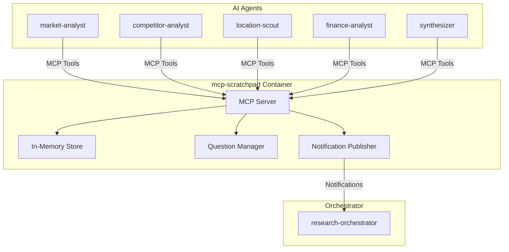
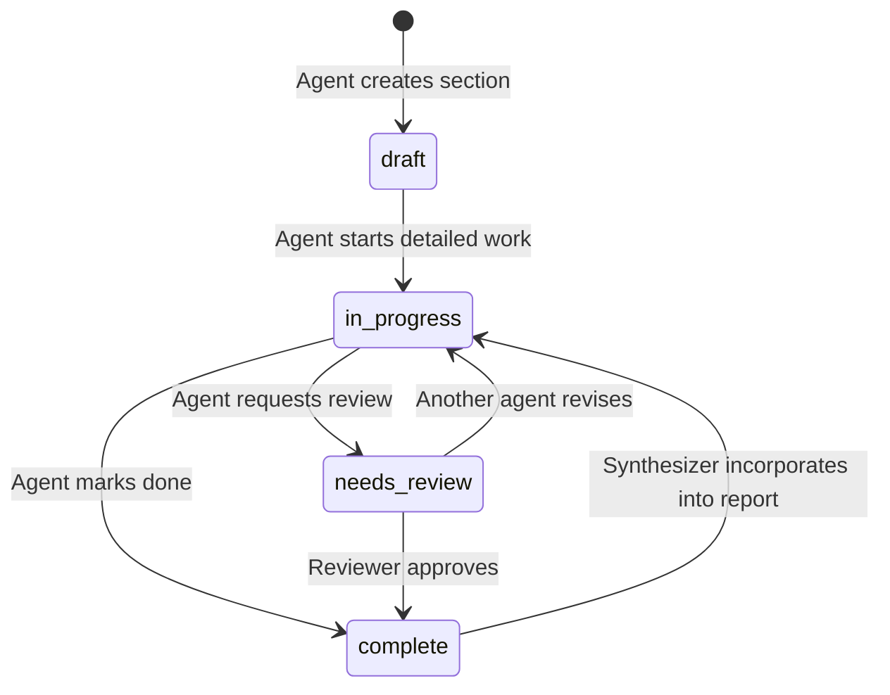
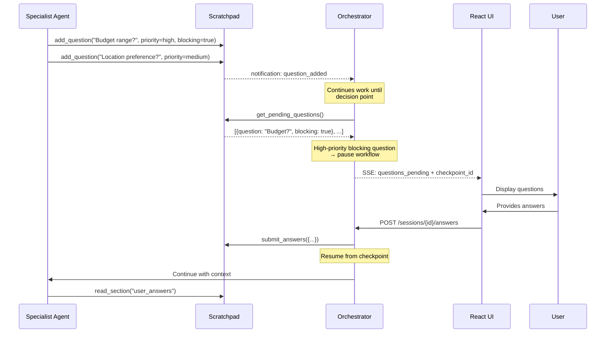
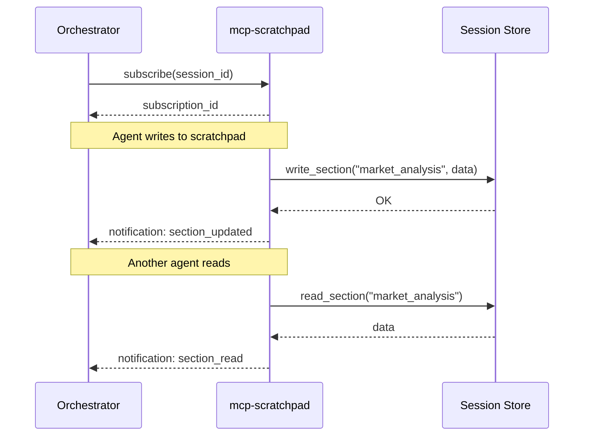

# Service Architecture: mcp-scratchpad

MCP Server providing shared workspace for inter-agent communication and collaborative document creation.

## Context

- **Purpose**: Shared memory/scratchpad for agents to collaborate on research findings, build working documents, track progress, and queue questions for human review
- **Upstream Dependencies**: None
- **Downstream Dependencies**: 
  - Container Apps Environment (deployment)

> **Note (Demo Phase)**: Data is stored in-memory only. Sessions are lost on service restart. Cosmos DB persistence planned for production.

## Design Philosophy

### Agent Inputs/Outputs vs. Scratchpad

| Concept | Purpose | Example |
|---------|---------|---------|
| **Agent Input** | Concise task instruction from orchestrator | "Analyze coffee market in Prague, focus on specialty segment" |
| **Agent Output** | Status + key insights summary (keeps orchestrator context manageable) | "Analysis complete. Found 3 key competitors. Details in scratchpad." |
| **Scratchpad** | Collaborative workspace for detailed findings and evolving documents | Full market analysis, competitor profiles, draft report sections |

The scratchpad is the **working memory** where agents collaborate on the actual deliverable (final report), while agent inputs/outputs are lightweight coordination messages.

## Component Diagram



## MCP Tools

### Section Management (Collaborative Document)

| Tool | Description |
|------|-------------|
| `read_section` | Read a named section from scratchpad |
| `write_section` | Write/overwrite content to a named section (with metadata) |
| `append_to_section` | Append content to existing section |
| `list_sections` | List all sections with their status and metadata |

### Progress Tracking

| Tool | Description |
|------|-------------|
| `update_checklist` | Update task completion status |
| `get_checklist` | Get current checklist state |

### Human Questions Queue

| Tool | Description |
|------|-------------|
| `add_question` | Add a question for human review |
| `get_pending_questions` | Get all unanswered questions |
| `submit_answers` | Submit human answers (called by orchestrator) |
| `get_answered_questions` | Get questions that have been answered |

## Scratchpad Section Structure

Sections are structured to support collaborative editing and document evolution:

```
sections:
  market_findings:
    status: "complete"           # draft | in_progress | complete | needs_review
    author: "market-analyst"     # Primary author
    contributors: ["synthesizer"] # Other agents that modified
    version: 3
    content: "..."
    outline_position: 2          # Position in final report (null if not in report)
    last_updated: "2025-11-28T10:00:00Z"
    
  final_report:
    status: "draft"
    author: "synthesizer"
    contributors: ["market-analyst", "competitor-analyst", "finance-analyst"]
    version: 7
    content: |
      # Coffee Shop Feasibility Study - Prague
      
      ## Executive Summary
      [synthesizer builds this progressively]
      
      ## Market Analysis
      [pulled from market_findings]
      ...
    outline_position: null       # This IS the report
    last_updated: "..."
```

### Section Lifecycle



## Human Questions Architecture

### Question Queue Flow

Agents can add questions at any time. The orchestrator decides when to pause and ask the user.



### Question Properties

| Field | Type | Description |
|-------|------|-------------|
| `id` | string | Unique question ID |
| `question` | string | The question text |
| `context` | string | Why this information is needed |
| `asked_by` | string | Agent that asked |
| `priority` | enum | `high`, `medium`, `low` |
| `blocking` | bool | If true, workflow should pause for this |
| `options` | list[string] | Optional multiple choice options |
| `answer` | string | Human's answer (null until answered) |
| `answered_at` | datetime | When answered |

### When Does Orchestrator Pause?

The orchestrator uses these heuristics:
1. **Immediate**: Any `blocking=true` question with `priority=high`
2. **Phase boundary**: Accumulated questions before major transition (market→competitor→finance)
3. **Explicit request**: Agent output includes "need human input to continue"
4. **Threshold**: More than 3 unanswered questions accumulated

## Technology Choices

| Component | Choice | Rationale |
|-----------|--------|----------|
| Runtime | Python 3.11 | Team familiarity, MCP SDK support |
| MCP SDK | `mcp[server]` | Official Python MCP SDK |
| Transport | SSE | Foundry MCP requirements |
| Persistence | In-memory (dict) | Demo simplicity, no external deps |
| Framework | FastAPI (for health) | Lightweight, async |

> **Future**: Add Cosmos DB persistence for production (session recovery, multi-instance).

## Session Management

Scratchpad is session-scoped:
- Each research session gets isolated storage
- Session ID passed via MCP context
- Data retained for 24 hours then archived

## MCP Notifications (Subscriptions)

The scratchpad server implements MCP notifications to enable real-time updates when scratchpad content changes. This allows the orchestrator (and UI) to stream changes without polling.

### Notification Flow



### Notification Types

| Notification | Payload | Description |
|--------------|---------|-------------|
| `scratchpad/section_created` | `{session_id, section_name, timestamp}` | New section created |
| `scratchpad/section_updated` | `{session_id, section_name, content_preview, timestamp}` | Section content changed |
| `scratchpad/section_read` | `{session_id, section_name, reader_agent, timestamp}` | Section was read by an agent |
| `scratchpad/checklist_updated` | `{session_id, item_id, old_status, new_status, timestamp}` | Checklist item changed |

### Subscription API

Clients subscribe via standard MCP notification mechanism:

```json
{
  "method": "notifications/subscribe",
  "params": {
    "session_id": "sess_123",
    "events": ["scratchpad/section_updated", "scratchpad/checklist_updated"]
  }
}
```

Notifications are delivered over the same SSE transport used for MCP tool calls.

### Implementation Notes

- Subscriptions are tied to session lifetime
- Notifications include `content_preview` (first 200 chars) to avoid large payloads
- Full content retrieved via `read_section` tool if needed
- Server maintains in-memory subscription registry per session

## Performance Targets
| Metric | Target |
|--------|--------|
| Tool call latency | < 100ms (p95) |
| Notification delivery | < 50ms |
| Concurrent sessions | 50 |
| Subscriptions per session | 10 |
