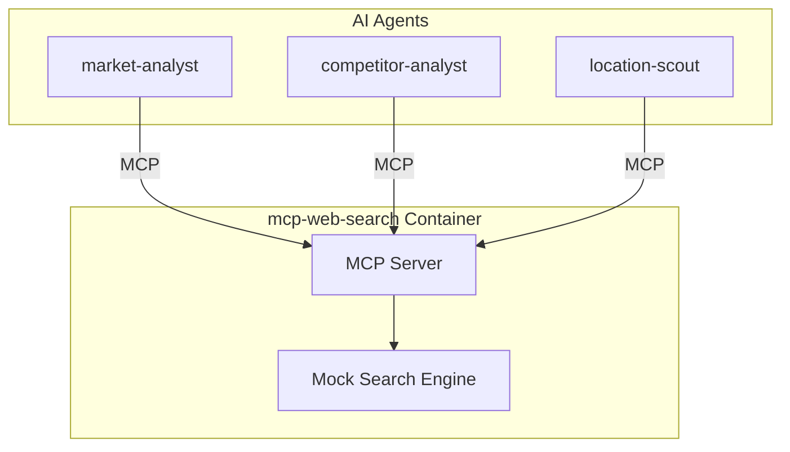

# Service Architecture: mcp-web-search

MCP Server providing web search and news capabilities.

## Context

- **Purpose**: General web search, news search, and image search for research
- **Used By**: market-analyst, competitor-analyst, location-scout
- **Downstream Dependencies**: Container Apps Environment (mock data in demo)

## Component Diagram

## MCP Tools

| Tool | Description |
|------|-------------|
| `search_web` | General web search with query and filters |
| `search_news` | Search recent news articles |
| `search_images` | Search for images (business logos, storefronts) |
| `get_webpage_content` | Extract content from a specific URL |
| `search_social_media` | Search social media mentions |

## Technology Choices

| Component | Choice | Rationale |
|-----------|--------|-----------|
| Runtime | Python 3.11 | Team familiarity |
| MCP SDK | `mcp[server]` | Official SDK |
| Transport | SSE | Foundry requirements |
| Data | Mock responses | Demo purposes (would use Bing API in production) |

## Performance Targets
| Metric | Target |
|--------|--------|
| Tool call latency | < 200ms (p95) |
| Concurrent requests | 20 |
