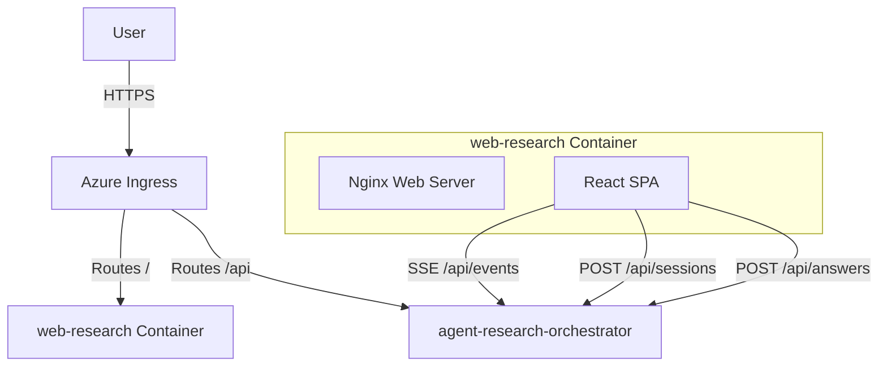

# Service Architecture Snapshot: web-research

Frontend application for the Agentic Research scenario, providing a real-time, collaborative workspace visualization for the multi-agent system.

## Context
- **Purpose**: 
  - Provide a modern, "ChatGPT-like" interface for users to initiate research.
  - Visualize the internal state of the multi-agent system (Plan, Notes, Draft).
  - Facilitate human-in-the-loop interactions (answering agent questions).
- **Upstream Dependencies**: 
  - `agent-research-orchestrator`: Source of all state and events via SSE.
- **Downstream Dependencies**: None (Client-side app).

## Component Diagram

## Data Flow

1. **Session Initialization**:
   - User visits web app.
   - Enters research query (e.g., "Should we expand to Vienna?").
   - App POSTs to `/api/sessions` on Orchestrator.
   - App subscribes to SSE endpoint `/api/sessions/{id}/events`.

2. **Real-Time Updates**:
   - Orchestrator pushes events (`task_updated`, `note_added`, `draft_updated`, `message_logged`).
   - React App updates local state stores (Redux/Context).
   - UI re-renders specific panels (Plan, Notes, Draft, Chat).

3. **Human Input**:
   - Orchestrator pushes `question_pending` event.
   - UI displays modal or chat bubble with question.
   - User provides answer.
   - App POSTs to `/api/sessions/{id}/answers`.

## UI Layout & State Visualization

The UI is divided into a "Command Center" layout:

| Section | Visualization | Purpose |
|---------|---------------|---------|
| **Chat Stream** | Group Chat | Shows orchestration messages ("Assigning task to Market Analyst", "Task complete"). Hides raw data. |
| **Plan** | Checklist | Shows the shared `Plan` from Scratchpad. Status indicators (Pending, In-Progress, Done). |
| **Notes** | Feed/List | Append-only list of `Notes` from Scratchpad. Shows source agent and timestamp. |
| **Draft** | Document View | Live-updating view of the `Draft` document. Markdown rendered. |
| **Input Area** | Text Box | For initial query and answering agent questions. |

## Cross-Cutting Concerns
- **Resilience**: 
  - Automatic SSE reconnection with exponential backoff.
  - State reconciliation on reconnect (fetch full state).
- **Configuration**:
  - Runtime configuration via `config.js` generated from environment variables at container startup.
- **Performance**:
  - Optimistic UI updates where appropriate.
  - Markdown rendering optimization (memoization).
