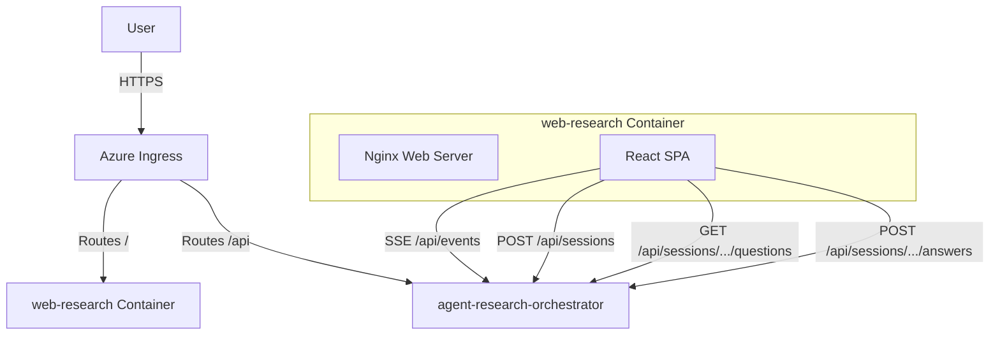

# Service Architecture Snapshot: web-research

Frontend application for the Agentic Research scenario, providing a real-time, collaborative workspace visualization for the multi-agent system.

## Context
- **Purpose**: 
  - Provide a modern, "ChatGPT-like" interface for users to initiate research.
  - Visualize the internal state of the multi-agent system (Plan, Notes, Draft).
  - Facilitate human-in-the-loop interactions (answering agent questions).
- **Upstream Dependencies**: 
  - `agent-research-orchestrator`: Source of all state and events via SSE.
- **Downstream Dependencies**: None (Client-side app).

## Component Diagram



## Data Flow

1. **Session Initialization**:
   - User visits web app.
   - Enters research query (e.g., "Should we expand to Vienna?").
   - App POSTs to `/api/sessions` on Orchestrator.
   - App subscribes to SSE endpoint `/api/sessions/{id}/events`.
   - App starts polling for scratchpad state (Plan, Notes, Draft, Questions).

2. **Real-Time Updates**:
   - Orchestrator pushes events (`task_updated`, `note_added`, `draft_updated`, `message_logged`).
   - React App updates local state stores (Redux/Context).
   - UI re-renders specific panels (Plan, Notes, Draft, Chat).

3. **Questions Polling**:
   - App polls `/api/sessions/{id}/questions` at regular intervals (e.g., 2s).
   - SSE `question_added` event triggers immediate refresh.
   - SSE `awaiting_user_input` event displays workflow waiting indicator.
   - Questions panel renders all questions with priority badges.

4. **Human Input (Save & Unblock)**:
   - User fills in answers to one or more questions.
   - User clicks Save button.
   - App POSTs to `/api/sessions/{id}/answers` with all filled answers.
   - If workflow was blocked, it automatically unblocks.
   - SSE `questions_answered` event confirms processing.
   - UI clears workflow waiting indicator and marks questions as answered.

## UI Layout & State Visualization

The UI is divided into a "Command Center" layout:

| Section | Visualization | Purpose |
|---------|---------------|---------|
| **Chat Stream** | Group Chat | Shows orchestration messages ("Assigning task to Market Analyst", "Task complete"). Hides raw data. |
| **Plan** | Checklist | Shows the shared `Plan` from Scratchpad. Status indicators (Pending, In-Progress, Done). |
| **Notes** | Feed/List | Append-only list of `Notes` from Scratchpad. Shows source agent and timestamp. |
| **Draft** | Document View | Live-updating view of the `Draft` document. Markdown rendered. |
| **Questions** | Interactive List | Displays questions from agents, allows user to provide answers. Shows priority badges. |
| **Input Area** | Text Box | For initial query and answering agent questions. |

### Questions Panel

The Questions panel provides human-in-the-loop interaction capabilities:

```
┌─────────────────────────────────────────────────────────────┐
│  Questions (3 pending)                            [Save]    │
├─────────────────────────────────────────────────────────────┤
│  🔴 BLOCKING  finance-analyst                    10:32 AM   │
│  ┌───────────────────────────────────────────────────────┐  │
│  │ What is your annual marketing budget for expansion?   │  │
│  │ Context: Need budget info for ROI calculations        │  │
│  │ ┌─────────────────────────────────────────────────┐   │  │
│  │ │ €500,000 annually                              │   │  │
│  │ └─────────────────────────────────────────────────┘   │  │
│  └───────────────────────────────────────────────────────┘  │
│                                                             │
│  🟠 HIGH  market-analyst                         10:28 AM   │
│  ┌───────────────────────────────────────────────────────┐  │
│  │ Which competitors should we prioritize analyzing?     │  │
│  │ Context: Can analyze 3-5 competitors in depth         │  │
│  │ ┌─────────────────────────────────────────────────┐   │  │
│  │ │                                                │   │  │
│  │ └─────────────────────────────────────────────────┘   │  │
│  └───────────────────────────────────────────────────────┘  │
│                                                             │
│  ✅ ANSWERED  location-scout                      10:15 AM  │
│  ┌───────────────────────────────────────────────────────┐  │
│  │ Are there any specific districts to avoid?            │  │
│  │ Answer: Avoid outer districts, focus on 1-9           │  │
│  └───────────────────────────────────────────────────────┘  │
└─────────────────────────────────────────────────────────────┘
```

#### Question Priority Badges

| Badge | Priority | Visual | Meaning |
|-------|----------|--------|---------|
| 🔴 | `blocking` | Red, pulsing | Workflow waiting - requires immediate attention |
| 🟠 | `high` | Orange | Important for accuracy |
| 🟡 | `medium` | Yellow | Improves quality |
| ⚪ | `low` | Gray | Nice to have |

#### Workflow Waiting Indicator

When the orchestrator calls `request_human_input()`, the UI should display a prominent indicator:

```
┌──────────────────────────────────────────────────────────────┐
│  ⏸️ WORKFLOW WAITING FOR YOUR INPUT                          │
│  Please answer the blocking question(s) and click Save       │
│  ────────────────────────────────────────────────────────────│
│  Waiting since: 10:32 AM (2 minutes)                         │
└──────────────────────────────────────────────────────────────┘
```

#### Save Button Behavior

The Save button submits all filled-in answers and unblocks the workflow:

1. Collects all questions with non-empty answers
2. POSTs to `/api/sessions/{id}/questions/answers`
3. If workflow was waiting, it automatically resumes
4. UI updates to show answered questions as resolved

## Cross-Cutting Concerns
- **Resilience**: 
  - Automatic SSE reconnection with exponential backoff.
  - State reconciliation on reconnect (fetch full state).
- **Configuration**:
  - Runtime configuration via `config.js` generated from environment variables at container startup.
- **Performance**:
  - Optimistic UI updates where appropriate.
  - Markdown rendering optimization (memoization).
